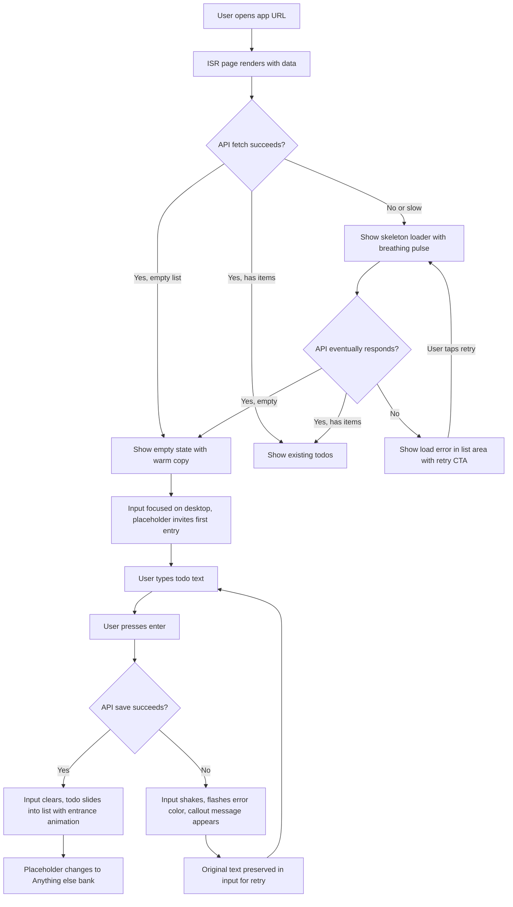
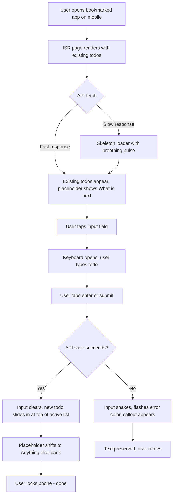
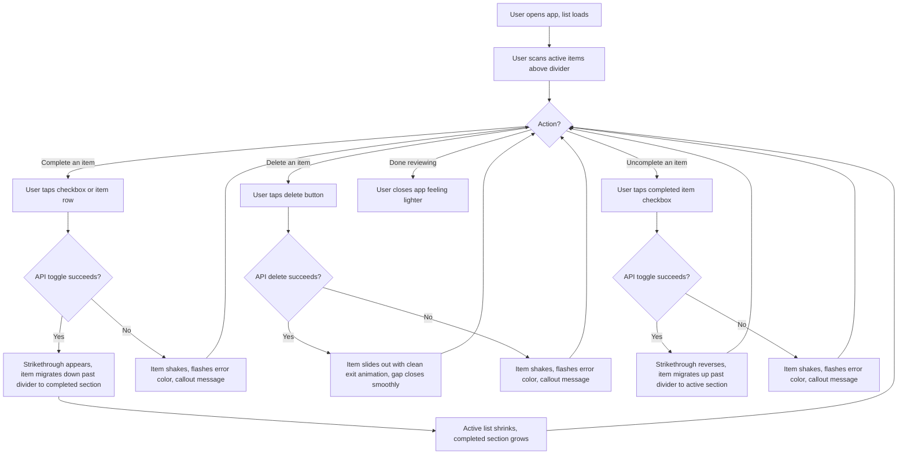
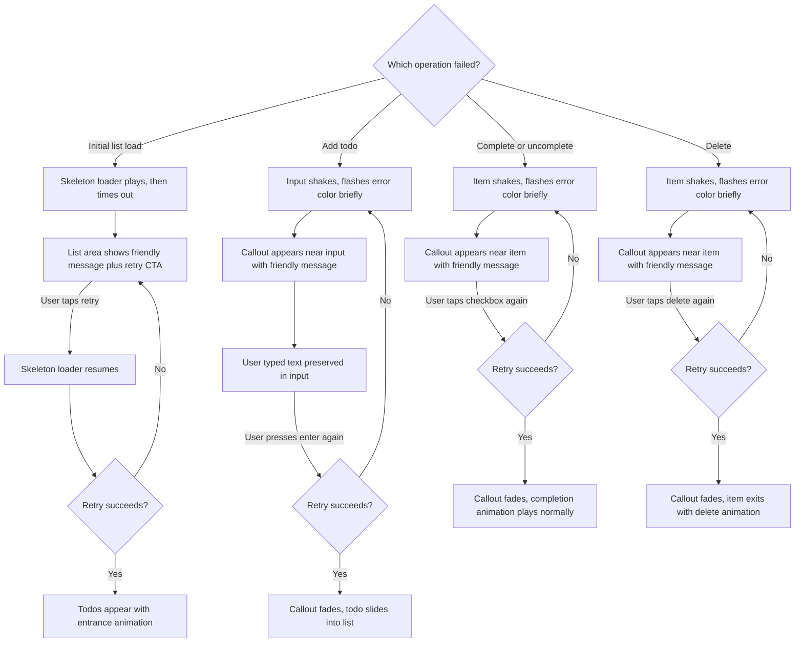

---
stepsCompleted:
  - step-01-init
  - step-02-discovery
  - step-03-core-experience
  - step-04-emotional-response
  - step-05-inspiration
  - step-06-design-system
  - step-07-defining-experience
  - step-08-visual-foundation
  - step-09-design-directions
  - step-10-user-journeys
  - step-11-component-strategy
  - step-12-ux-patterns
  - step-13-responsive-accessibility
  - step-14-complete
inputDocuments:
  - _bmad-output/planning-artifacts/prd.md
  - requirements/requirements.md
  - _bmad-output/planning-artifacts/validation-report-20260313-165255.md
---

# UX Design Specification - todo-bmad

**Author:** Kevin
**Date:** 2026-03-13

---

<!-- UX design content will be appended sequentially through collaborative workflow steps -->

## Executive Summary

### Project Vision

A deliberately minimal single-user Todo application where the value lies in craftsmanship within tight constraints. With only four actions — create, view, complete, and delete — every pixel, every transition, and every interaction carries weight. The UX goal is to make this narrow feature set feel stunning: fast, clean, and alive with purposeful animation. Zero onboarding, zero clutter, zero friction.

### Target Users

A general-purpose individual managing personal tasks. Not power users demanding advanced workflows, and not novices needing hand-holding — people who expect tools to just work. They use both desktop and mobile, capture tasks in quick bursts (under 10 seconds), and occasionally review and tidy their list. They appreciate clean design and notice when things feel polished.

### Key Design Challenges

- **Empty state as invitation:** The first-visit experience is almost entirely blank. The empty state must feel purposeful and welcoming, clearly communicating the app's interaction model without explicit instructions.
- **Animation performance and accessibility:** Rich micro-interactions and transitions must run at 60fps while fully respecting `prefers-reduced-motion` preferences. Every animation must enhance comprehension, not just decorate.
- **Touch elegance across devices:** Minimum 44x44px touch targets for mobile interactions must feel generous without making the desktop layout appear oversized. Interaction affordances need to be discoverable but visually lightweight.

### Design Opportunities

- **Micro-interactions as product signature:** With so few actions, each one — adding a todo, toggling completion, deleting an item — can have a carefully crafted animation that defines the product's personality and makes it feel alive.
- **Typography and whitespace as hero elements:** No sidebar, no navigation complexity, no feature clutter. The list itself is the design. Premium typography, generous spacing, and intentional hierarchy elevate a simple list into something that feels refined.
- **State transitions as storytelling:** Empty → first item, active → completed, error → recovery — each transition is a moment to delight through subtle entrance animations, satisfying check-off effects, and graceful error recovery.

## Core User Experience

### Defining Experience

The core experience is a tight loop between two equally rewarding actions: **capture** and **complete**. Capture provides the relief of getting a thought out of your head and into a trusted place. Completion provides the satisfaction of accomplishment. Both must feel equally intentional and rewarding — neither is secondary. The delete action serves as a quieter third beat: clearing away what's no longer relevant, a small act of tidying that reinforces control.

The primary interaction — adding a todo — must be achievable in under 10 seconds from app open, including on mobile. The completion interaction must deliver an unmistakable moment of satisfaction through visual and motion feedback.

### Platform Strategy

- **Web application:** Server-rendered with ISR (Incremental Static Regeneration) and client-side hydration for dynamic CRUD operations
- **Mobile-first responsive:** Designed for touch first (320px+), with mouse and keyboard as fully supported secondary inputs
- **No offline write capability in MVP:** The server-rendered page always loads with cached data, but write operations require API connectivity. Failures are handled gracefully with clear, personality-driven error messaging and an obvious retry path
- **Keyboard navigation:** Full keyboard accessibility (tab, enter, escape) required for WCAG compliance. Dedicated keyboard shortcuts deferred to Phase 2
- **Browser support:** Latest 2 versions of Chrome, Firefox, Safari, Edge, plus mobile Safari and Chrome

### Effortless Interactions

- **Adding a todo:** Input is always visible and prominent. Type and hit enter. No modal, no button hunting, no multi-step flow. The new todo appears with a satisfying entrance animation that confirms the capture.
- **Completing a todo:** Single tap or click on the item or its checkbox. The completion animation is the reward — it must feel celebratory without being slow or disruptive.
- **Deleting a todo:** Single-action removal with a clear but lightweight gesture. The item exits with purpose — not just vanishing, but visibly leaving.
- **Scanning the list:** Active and completed todos are visually distinct at a glance. The hierarchy is immediately legible. No parsing required.

### Critical Success Moments

1. **The first 15 seconds (Journey 1):** User opens the app, sees an empty state that's inviting (not barren), immediately understands what to do, types a todo, and sees it appear. This is the entire pitch. If this sequence feels magical, trust is established.
2. **The quick capture (Journey 2):** User opens on mobile, adds a todo in under 10 seconds, and puts the phone down. Speed is the reward. Any friction here breaks the value proposition.
3. **The satisfying cleanup (Journey 3):** User checks off completed items and watches them transition to a "done" state. The visual feedback creates a small sense of accomplishment. Deleting irrelevant items feels like tidying a desk.
4. **The graceful stumble (Journey 4):** Something goes wrong but the app handles it with personality — a friendly, slightly playful error message that disarms rather than alarming. The user smiles instead of worrying. Retry is obvious.

### Experience Principles

1. **Every action is a reward** — Capture feels like relief, completion feels like accomplishment, deletion feels like clearing the deck. No interaction should feel neutral or transactional.
2. **The interface disappears** — The user thinks about their tasks, never about the tool. Zero cognitive overhead, zero decisions about how to use it.
3. **Motion tells the story** — Animations aren't decoration; they're narrative. A todo sliding in confirms capture. A check animation celebrates completion. Transitions communicate state changes before the user consciously processes them.
4. **Personality lives in the details** — This is not enterprise software. Error messages can be witty. Empty states can be charming. The app has a voice — relaxed, warm, slightly playful.

## Desired Emotional Response

### Primary Emotional Goals

- **Calm confidence:** The dominant feeling is quiet control. The user always knows where they are, what they can do, and that their data is safe. Nothing about the interface creates urgency or demands attention.
- **Earned satisfaction:** Every completed action delivers a proportional emotional reward — not loud, not showy, but unmistakably present. Capture feels like setting something down safely. Completion feels like a weight lifting.
- **Effortless trust:** The app earns trust through consistency and predictability. Things appear where expected, behave as anticipated, and never surprise negatively. Trust is built through a hundred small moments of "yes, that's exactly what should have happened."

### Emotional Journey Mapping

| Moment | Target Emotion | Design Implication |
|--------|---------------|-------------------|
| First discovery (empty state) | Curious, welcomed | Warm empty state that invites without instructing |
| First capture | Relief, small delight | Smooth entrance animation confirms the todo is safely captured |
| Returning visit | Confidence, trust | List loads instantly with data ready — no uncertainty |
| Completing a task | Quiet accomplishment | Subtle transition conveys "this weight is off your mind" |
| Cleaning up (delete) | Control, clarity | Item exits cleanly — the list feels tidier |
| Error state | Amused, unbothered | Playful copy disarms; retry path is obvious |
| Idle / scanning | Calm composure | Still and composed — no ambient motion, just clean typography and space |

### Micro-Emotions

- **Confidence over confusion:** Every element's purpose is immediately obvious. No ambiguity about what's clickable, what's a status, what's an action.
- **Trust over skepticism:** Data persistence is communicated through reliable, consistent behavior. The user never wonders "did that save?"
- **Accomplishment over frustration:** Every interaction succeeds smoothly. When it can't (error state), the tone stays light and the path forward is clear.
- **Calm over excitement:** The emotional register is warm and understated. No aggressive animations, no flashy transitions, no attention-grabbing elements competing for focus.

### Design Implications

- **Motion is interaction-driven only:** The interface is still and composed at rest. Animation occurs exclusively in response to user actions — adding, completing, deleting, or error recovery. This makes every movement meaningful and intentional.
- **Completion animation = weight lifting:** The check-off interaction should feel like something receding or settling — a gentle fade, a smooth strikethrough, a quiet visual shift. Not celebratory fanfare, but the satisfying feeling of setting a burden down.
- **Capture animation = safe landing:** A new todo appearing should feel like it's been placed securely into the list. Smooth, confident entrance — the user sees their thought safely recorded.
- **Delete animation = clean exit:** The item leaves with quiet purpose. A slide, a fade — not dramatic, but visible enough that the user registers the list is now tidier.
- **Error tone = friendly, not formal:** Copy should be warm and slightly playful. "Well, that didn't work" over "Error: request failed." Disarm with personality.

### Emotional Design Principles

1. **Calm is the baseline** — The default state is composed stillness. Beautiful typography, generous whitespace, and visual clarity. The app never demands attention; it waits patiently.
2. **Motion earns its place** — Every animation is triggered by user action and serves a communicative purpose. If removing an animation wouldn't reduce comprehension, it shouldn't exist.
3. **Subtle over spectacular** — Achievement is conveyed through understated, elegant transitions rather than dramatic effects. The emotional register is warm satisfaction, never fireworks.
4. **Tone matches stakes** — Todo management is low-stakes by nature. The emotional design reflects this: relaxed, warm, lightly playful. Nothing in the experience should create stress or pressure.

## UX Pattern Analysis & Inspiration

### Inspiring Products Analysis

No specific product references adopted. The design direction for todo-bmad is intentionally unanchored from existing todo applications to allow the visual and interaction design to emerge from the product's own principles: calm confidence, interaction-driven motion, and personality in the details. The goal is not to replicate what exists but to craft something that feels distinctly its own within a familiar category.

### Transferable UX Patterns

**Input Patterns:**
- **Persistent visible input:** The text input is always present and prominent — never hidden behind a button or modal. This is the most important element on screen and should be treated as such.
- **Submit on enter:** The fastest path from thought to captured todo. No submit button required (though one may exist as a secondary affordance for touch/accessibility).

**List Patterns:**
- **Single-list with visual state separation:** Active and completed items coexist in one list with clear visual distinction rather than being split into separate tabs or views. Keeps the mental model simple — one place for everything.
- **Inline actions:** Complete and delete are available directly on each item without expanding, swiping, or opening a menu. One action, one gesture.

**Feedback Patterns:**
- **Pending state feedback:** Show a pending indicator on the affected element while waiting for API confirmation. On success, play the appropriate animation and update the UI. On failure, clear the pending state and show a friendly error. For todo creation, the input clears immediately for responsiveness and the text is cached — if the API fails, a restore action in the error callout lets the user recover their input.
- **Animated state transitions:** Every add, complete, and delete triggers a purposeful animation that communicates what happened. No state change occurs without visual motion.

**Loading Patterns:**
- **Breathing skeleton loader (initial list load):** On slower networks where the initial fetch of existing todos has perceptible delay, display placeholder skeleton shapes that pulse with a slow, organic breathing rhythm. This communicates "your data is coming" with the same calm composure as the rest of the app — never frantic, never urgent.
- **Anticipation animation (new item creation):** When adding a todo on a slow connection, an anticipatory animation in the list area signals that something is arriving — a subtle opening of space or a gentle placeholder pulse where the new item will land. The user sees their action acknowledged before the API confirms it.
- **No full-page loading states:** The ISR-rendered page includes real data on first paint. Loading indicators are scoped to the content area only — the input and app chrome are always interactive and ready.

**Error Patterns:**
- **Inline error with personality:** Errors appear contextually near the failed action, not in a global toast or banner. Copy is warm and human, with an obvious retry path.
- **Graceful degradation:** The page shell always renders. If the API is down during server render, the user sees a friendly empty/error state with a clear explanation rather than a broken page.

### Anti-Patterns to Avoid

- **Modal overload:** No confirmation dialogs for delete or any other action. A todo app should never ask "are you sure?" — the action should be lightweight and, if needed, reversible rather than guarded.
- **Feature creep affordances:** No hamburger menus, settings icons, or navigation elements that hint at features that don't exist. The interface should contain exactly what it does, nothing more.
- **Generic error messaging:** No "Something went wrong" or "Error 500" — every error state should feel like a human wrote it for this specific moment.
- **Loading spinners as dead time:** No spinning wheels or progress bars. Skeleton loaders and anticipation animations keep the interface feeling alive and composed rather than frozen and waiting.
- **Visual noise for status:** Don't use badges, counters, or status bars. The list itself is the status — the ratio of active to completed items tells the whole story at a glance.

### Design Inspiration Strategy

**What to Build From:**
- Our own experience principles (calm confidence, interaction-driven motion, personality in details) as the primary design driver
- The inherent advantage of extreme simplicity — with only a handful of elements on screen, every one can be crafted with unusual care

**What to Prioritize:**
- Typography, spacing, and color as the foundational design language — these carry the entire visual identity
- A small library of polished animations (enter, complete, delete, error, skeleton load, anticipation) that become the product's signature
- Playful, human copywriting for empty and error states that give the app a distinct voice

**What to Resist:**
- Borrowing visual patterns from existing todo apps that carry baggage or expectations
- Adding visual complexity to compensate for feature simplicity — the simplicity is the point
- Defaulting to safe, generic UI patterns when the narrow scope allows for bolder design choices

## Design System Foundation

### Design System Choice

**Approach:** Headless primitives with custom styling, using shadcn/ui as the foundation.

shadcn/ui provides accessible, unstyled component primitives (built on Radix UI) with a Tailwind CSS styling layer. Components are copied into the project as owned source code — not imported from an external dependency — giving full control over visual presentation, animation, and behavior. This is a design system you build *with*, not one you build *on top of*.

### Rationale for Selection

- **Full visual control:** Components are owned source code, not a library. Every pixel, animation, and interaction can be customized without fighting library opinions or overriding defaults.
- **Accessibility out of the box:** Radix UI primitives handle focus management, keyboard navigation, ARIA attributes, and screen reader compatibility — the hardest parts of WCAG 2.1 AA compliance are solved at the foundation layer.
- **Minimal footprint:** Only the components actually used are included in the project. With a surface area of ~5 components (input, checkbox, button, list item, error display), the bundle impact is negligible — supporting Lighthouse 90+ performance targets.
- **Animation freedom:** No pre-built animation opinions to override. The custom animation library (enter, complete, delete, skeleton, anticipation) can be built as a first-class concern rather than layered on top of existing transitions.
- **Tailwind CSS foundation:** Utility-first CSS enables rapid iteration on spacing, typography, color, and responsive design while maintaining consistency through design tokens.

### Implementation Approach

**Component inventory (MVP):**
- Text input (todo creation)
- Checkbox (todo completion toggle)
- Button (submit affordance, delete action, retry action)
- List container and list item
- Skeleton loader
- Inline error display

**Design token layer:**
- Color palette, typography scale, spacing scale, border radii, and shadow definitions as Tailwind/CSS custom properties
- Motion tokens: duration, easing curves, and animation definitions as reusable values
- Responsive breakpoints aligned with PRD targets (320px+, 768px+, 1024px+)

### Customization Strategy

- **Start from shadcn primitives** for the checkbox, input, and button — then strip back and restyle to match the product's visual identity rather than shadcn's default aesthetic.
- **Build custom components** for the todo list item (combining checkbox, text, timestamp, and delete action into a single cohesive element), empty state, and error state — these are unique to the product and don't map to standard primitives.
- **Create a bespoke animation system** as a dedicated layer: entrance (capture), completion (weight lifting), deletion (clean exit), skeleton (breathing pulse), anticipation (arrival signal), and error (friendly attention). These animations are the product's signature and should be defined as reusable, composable motion primitives.
- **Respect `prefers-reduced-motion`:** All animations must have reduced-motion alternatives that convey the same state changes without movement — instant transitions, opacity changes, or no animation at all.

## Defining Interaction

### The Core Experience

**"Type a thought, hit enter, it's out of your head."**

The defining interaction for todo-bmad is the capture loop — the moment between having a thought and seeing it safely recorded. This is the interaction users would describe to a friend. The completion check-off is the equally rewarding counterpart, but capture is the gateway. If capture doesn't feel instant and effortless, nothing else matters.

### User Mental Model

The mental model is a paper list. Write something down. Check it off. Cross it out. There is nothing novel about the interaction pattern — users bring complete intuition for how a todo list works. The innovation is entirely in how it *feels*. Familiar patterns executed with uncommon craft.

### Success Criteria

- **Capture in under 10 seconds** from app open (including on mobile)
- **Zero hesitation** — the user never pauses to figure out how to add, complete, or delete
- **Every action produces visible, immediate feedback** — no state change without animation
- **The list always reflects reality** — pending indicators while API calls are in flight, confirmed updates on success, clear error feedback on failure
- **The user feels lighter after each interaction** — capture = relief, complete = accomplishment, delete = clarity

### Contextual Input Placeholder

The input placeholder text rotates through a small bank of contextual messages based on list state, giving the app a subtle sense of awareness:

**Empty list (~5 variations):**
Messages that acknowledge the blank slate and invite the first entry. Warm, encouraging tone.
- "What's first...?"
- (4 additional variations in similar tone — inviting, acknowledging the fresh start)

**Has items (~5 variations):**
Messages that suggest forward momentum. The default state.
- "What's next...?"
- (4 additional variations in similar tone — forward-looking, casual)

**Just added an item (~5 variations):**
Messages that feel conversational, like a friend checking if there's more.
- "Anything else...?"
- (4 additional variations in similar tone — gentle follow-up, no pressure)

Placeholder selection is random within each bank to avoid predictable repetition. Transitions between placeholder states happen naturally as the list state changes — no animation on the placeholder text itself.

### Experience Mechanics

**Capture (adding a todo):**

| Phase | Detail |
|-------|--------|
| Initiation | Input field is always visible and prominent. Auto-focused on desktop page load. Contextual placeholder invites action. |
| Interaction | User types text, presses enter or taps submit button. |
| Feedback | Input clears instantly (text cached for recovery). Anticipation animation plays in list area. On API success, new todo slides into list with entrance animation. Placeholder updates to "just added" bank. On failure, error callout appears near input with restore action to recover text. |
| Completion | Input is immediately ready for the next entry. No mode change, no confirmation. |

**Complete (checking off a todo):**

| Phase | Detail |
|-------|--------|
| Initiation | Checkbox or todo item row is the tap/click target. |
| Interaction | Single tap or click. |
| Feedback | Checkbox shows pending indicator. On API success, text receives a gentle strikethrough and the item smoothly migrates down the list to join the completed section — the reorder animation is calm and purposeful, not a snap. This movement is the reward. On failure, pending clears, item shakes, error callout appears. |
| Completion | Active list is visibly shorter. Completed item is still visible below, visually receded. |

**Uncomplete (restoring a todo):**

| Phase | Detail |
|-------|--------|
| Initiation | Tap/click the completed item's checkbox. |
| Interaction | Single tap or click. |
| Feedback | Strikethrough reverses. The item migrates back up to rejoin the active section. |
| Completion | Active list grows by one. The item is fully restored. |

**Delete (removing a todo):**

| Phase | Detail |
|-------|--------|
| Initiation | Delete affordance is visible on each item (inline, no menu). |
| Interaction | Single tap or click. |
| Feedback | Item exits with a clean slide or fade — visible departure, not abrupt disappearance. Remaining items close the gap smoothly. |
| Completion | The list is tidier. No confirmation dialog, no undo toast (MVP). |

### List Ordering

Active (incomplete) items always appear above completed items. Within each group, items maintain creation-order (newest first for active items). When a todo is marked complete, it animates from its current position down to the completed section. When uncompleted, it animates back up. This reorder animation is central to the experience — the smooth migration communicates "this is handled, it's moving to the done pile."

### Novel vs. Established Patterns

All interaction patterns are fully established — the mental model is universal. The novelty is in execution quality:
- **Contextual placeholder rotation** adds personality without adding complexity
- **Reorder animation on completion** turns a status change into a spatial narrative
- **The animation library** (entrance, completion-migration, deletion, skeleton, anticipation) elevates standard CRUD into something that feels crafted

## Visual Design Foundation

### Color System

**Philosophy:** Light mode only for MVP, designed with CSS custom properties to enable straightforward dark mode addition in a future phase. Warm palette throughout — no stark whites, no pure blacks.

**Background Layer (warm neutrals):**
- **Primary background:** Warm off-white with a subtle cream undertone. Softer and more inviting than pure white, setting the calm tone immediately.
- **Surface/card:** A slightly warmer or deeper shade if subtle depth is needed for todo items, or same as background for a flatter, more minimal presentation. To be determined during implementation based on visual testing.

**Text Layer:**
- **Primary text:** Warm charcoal — softer than pure black, easier on the eyes, consistent with the calm emotional register.
- **Secondary text:** Medium warm gray for timestamps, metadata, and completed item text. Recedes without disappearing.
- **Placeholder text:** Lighter warm gray — inviting and visible but clearly distinguished from user-entered text.

**Accent Color:**
- **Primary accent: Warm amber** — confident, optimistic, and grounded without being aggressive. Used for checkbox filled state, input focus ring, submit affordance, and interactive highlights.
- Pairs naturally with warm neutral backgrounds and translates well to future dark mode (warm accents glow on dark backgrounds).
- Defined as a single design token (CSS custom property) for trivial swapability if the chosen hue doesn't feel right in implementation context.

**Semantic Colors:**
- **Success/completion:** A muted, warm tone that reinforces accomplishment without drawing excessive attention.
- **Error:** A warm but noticeable tone — distinct enough to register as an issue, soft enough to match the friendly error personality. Not alarming red.
- **Focus ring:** Accent color at visible contrast — supports both aesthetic and WCAG focus indicator requirements.

**Dark Mode Readiness:**
All colors defined as CSS custom properties (design tokens) rather than hard-coded values. The warm neutral scale and accent color are chosen to have natural dark mode complements. Adding dark mode in a future phase requires defining an alternate token set, not redesigning the palette.

### Typography System

**Approach:** Single sans-serif font family with warm, modern character. Soft geometry and slightly rounded terminals — approachable and inviting without being childish.

**Font selection criteria:**
- Sans-serif with warm personality (not clinical or corporate)
- Excellent legibility at body text sizes for todo descriptions
- Good weight range (regular, medium, semibold minimum) for hierarchy without multiple font families
- Strong web font performance (subset-able, small file size)
- Candidates in the spirit of: DM Sans, Plus Jakarta Sans, Nunito Sans — final selection during implementation

**No app title.** The UI communicates purpose through layout and interaction, not through a heading. The input field is the visual anchor — the largest, most prominent element on the page. Removing a title reinforces the zero-clutter principle and lets the interface speak for itself.

**Type Scale (minimal):**
- **Todo text (active):** Primary reading size. Regular weight, optimized for scannability. This is the most common text on screen.
- **Todo text (completed):** Same size as active, reduced opacity or lighter color with strikethrough.
- **Input text / placeholder:** Same size as todo text or slightly larger — the input is the hero element and should feel inviting to type into.
- **Secondary text:** Smaller size for timestamps and metadata. Regular weight, secondary color.
- **Error/empty state text:** Body size, distinguished by color and tone rather than size.

Scale ratios and exact sizes to be finalized during implementation, targeting a tight scale appropriate for the minimal content surface. No more than 3 distinct sizes across the entire application.

### Spacing & Layout Foundation

**Base unit:** 8px — all spacing derived from multiples (8, 16, 24, 32, 48, 64). Creates consistent visual rhythm and aligns with common screen densities.

**Content container:**
- **Max-width: ~600–640px**, centered horizontally. The todo list doesn't need to fill wide screens — a focused, narrow column creates natural visual focus and avoids a stretched, sparse feeling on desktop.
- **Mobile:** Full-width with comfortable horizontal padding (16–24px). The narrow max-width means the transition from desktop to mobile is minimal — the layout barely changes.

**Todo item spacing:**
- Generous vertical padding within each item — enough that the list feels open and breathable, not cramped.
- Touch targets naturally exceed the 44px minimum when items have comfortable padding.
- Consistent gap between items creates visual rhythm and clear item separation.

**Vertical flow:**
- Input area at the top — the most prominent element, the visual anchor of the page.
- Todo list below — single scrollable column.
- Empty/error states occupy the list area.
- Consistent spacing between major sections (input → list → states) using larger multiples of the base unit.

**Responsive behavior:**
- The centered narrow column means desktop and mobile layouts are nearly identical — the content is naturally mobile-friendly.
- Breakpoint adjustments are subtle: horizontal padding changes, minor font size adjustments, touch target sizing.
- No layout reflow or structural changes between breakpoints — the experience is consistent across devices.

### Accessibility Considerations

- **Color contrast:** All text/background combinations must meet WCAG 2.1 AA minimums (4.5:1 normal text, 3:1 large text). The warm palette is selected with contrast compliance in mind — warm charcoal on warm off-white provides comfortable contrast without harshness.
- **Focus indicators:** Accent-colored focus rings on all interactive elements with at least 3:1 contrast against adjacent colors. Visible and consistent.
- **No color-only information:** Completed items distinguished by strikethrough and position (bottom of list), not only by color change. Error states include text and icons, not just color.
- **Font sizing:** Base text size at minimum 16px to prevent mobile zoom issues and ensure comfortable readability.
- **Touch targets:** Minimum 44x44px for all interactive elements, achieved through generous item padding rather than oversized UI elements.

## Design Direction Decision

### Design Directions Explored

Six visual directions were generated and evaluated, ranging from ultra-minimal (borderless items on background) to compact-productive (tight spacing with explicit structure). All shared the established foundation: warm palette, no app title, centered narrow column, sans-serif typography, and generous spacing.

Full visual exploration available at: `_bmad-output/planning-artifacts/ux-design-directions.html`

### Chosen Direction

**Direction 4 (Warm Depth) + Direction 6 section divider**

A layered, dimensional aesthetic where each todo item lives in its own softly shadowed card floating above a warm background surface. A labeled divider separates active items from completed items, reinforcing the spatial narrative of completion.

**Key visual characteristics:**
- **Font:** Outfit — geometric, clean, modern with warmth
- **Item treatment:** Individual cards with soft shadow depth, creating a sense of physical presence
- **Hover interaction:** Subtle lift effect (translateY + deeper shadow) — items respond to attention with quiet tactility
- **Checkbox:** Rounded square (8px radius), warm amber fill on completion
- **Input:** Full-width card with matching shadow depth. Focus state adds accent-colored ring and slightly elevated shadow.
- **Completed items:** Reduced opacity (0.7), strikethrough text, settled below a labeled "Completed" divider
- **Section divider:** A subtle horizontal rule with a small uppercase "Completed" label between active and completed groups — borrowed from Direction 6 to give the two groups clear visual separation
- **Error treatment:** Card with left accent border in error color. Friendly copy with inline retry button that transitions to filled on hover.
- **Empty state:** Centered card with warm personality-driven copy

### Design Rationale

- **Warm Depth** aligns directly with the emotional goals: calm confidence expressed through soft materiality rather than flatness. The shadow depth gives items a sense of weight that makes the "weight lifting" completion animation more meaningful — the item visually recedes and migrates down.
- **Outfit typeface** balances geometric cleanliness with warmth — modern but not cold, approachable but not childish.
- **The section divider** reinforces the list ordering decision (active above, completed below) with explicit visual structure. It makes the spatial migration on completion more legible — the item doesn't just move down, it crosses a visible boundary.
- **The hover lift** creates the interaction-driven motion we specified without any ambient animation. The interface is perfectly still until the user engages.
- **Card-per-item** supports generous touch targets naturally — each card's padding creates ample tap area without oversizing individual elements.

### Implementation Approach

- Implement the Warm Depth card system as the primary component pattern using Tailwind utility classes and CSS custom properties for the shadow and color tokens
- The section divider is a simple styled element between the two list groups — lightweight to implement and easy to animate (it appears/disappears as items move between groups)
- Hover lift uses CSS transform and transition — no JavaScript animation needed for this baseline interaction
- The shadow tokens (resting shadow, hover shadow, focus shadow) should be defined as design tokens for consistency across input, cards, and error states
- Completed card opacity reduction is a CSS transition target for the completion animation sequence

## User Journey Flows

### Journey 1: First Visit (The Empty Canvas)

**Goal:** New user opens the app and creates their first todo within 15 seconds.

**Entry:** User navigates to the app URL (bookmark, shared link, direct entry).

**Key UX moments:**
- ISR page renders with real data — user sees their todos on first paint
- Empty state placeholder ("What's first...?") communicates purpose without instructions
- Auto-focus on desktop means the user can start typing immediately
- On success: input clears, todo appears with entrance animation, placeholder shifts to "Anything else...?"
- On failure: input shakes and flashes, callout explains the issue, typed text is preserved

### Journey 2: Quick Capture (The Rushing Thought)

**Goal:** Returning user adds a todo on mobile in under 10 seconds total.

**Entry:** User taps bookmarked app on mobile.

**Key UX moments:**
- Existing list loads with data ready — returning user sees their todos immediately
- Input tap, type, enter is the entire flow. Three actions.
- New todo appears at the top of active items — the user sees it land without scrolling
- Total time budget: ~2s page load + ~1s tap input + ~5s type + ~1s submit = under 10s

### Journey 3: Review and Tidy (The Satisfying Cleanup)

**Goal:** User reviews their list, checks off completed items, and deletes irrelevant ones.

**Entry:** User opens the app and sees their full list.

**Key UX moments:**
- The active/completed divider gives instant visual clarity about what is done vs. pending
- Completion animation: strikethrough + smooth migration downward past the "Completed" divider is the core reward moment
- Delete animation: clean slide-out with gap closing smoothly reinforces tidying
- Uncomplete: seamless reversal — item migrates back up
- Each error is scoped to the specific item that failed — no global disruption

### Journey 4: The Graceful Stumble (Error Recovery)

**Goal:** Something goes wrong but the user stays calm and recovers easily.

**Entry:** User is interacting with the app when an API failure occurs.

**Error UX patterns by type:**

| Error Type | Visual Feedback | Message Location | Retry Mechanism |
|-----------|----------------|-----------------|----------------|
| Initial load | Skeleton then friendly message | List area (replaces skeleton) | Explicit retry CTA button |
| Add todo | Input shakes + error color flash | Callout near input | User presses enter again (text preserved) |
| Complete/uncomplete | Item shakes + error color flash | Callout near the specific item | User taps checkbox again |
| Delete | Item shakes + error color flash | Callout near the specific item | User taps delete again |

**Error copy tone:** Warm, slightly playful, never technical. Examples:
- Load: "Couldn't reach your todos. They're probably fine — want to try again?"
- Add: "That one didn't stick. Give it another go?"
- Complete: "Hmm, couldn't update that one. Try again?"
- Delete: "Wouldn't let go of that one. One more try?"

### Journey Patterns

**Consistent patterns across all journeys:**
- **Responsive intent, honest feedback:** The UI acknowledges every action immediately with a pending indicator, then confirms with animation on success or shows a clear error on failure. No silent failures.
- **Scoped feedback:** Every error, animation, and state change is localized to the element it affects. No global banners, no full-page overlays.
- **Natural retry:** The retry action is always the same gesture the user already attempted — press enter again, tap the checkbox again, tap delete again. The load failure is the exception (explicit button) because the user didn't initiate the fetch.
- **Text recovery:** For add operations, the input clears immediately for responsiveness. If the API fails, the error callout includes a restore action that puts the cached text back in the input — zero data loss without blocking the input.

### Flow Optimization Principles

1. **Minimum viable path:** Every journey achieves its goal in the fewest possible actions. Add = type + enter. Complete = tap. Delete = tap.
2. **No dead ends:** Every error state has a visible, obvious path forward. The user is never stuck.
3. **Progressive response:** Fast networks get instant results. Slow networks get skeleton loaders and anticipation animations. Failed networks get friendly errors. The experience degrades gracefully through each tier.
4. **Animation as confirmation:** Every successful action produces a visible animation that confirms the outcome. The user never has to check whether their action worked.

## Component Strategy

### Design System Components (from shadcn/ui)

**Checkbox (Radix primitive):**
- Used within TodoItem for completion toggle
- Provides: focus management, keyboard toggle (Space), ARIA checked state, screen reader announcements
- Customized: rounded square (8px radius), warm amber fill on checked, custom check animation

**Input (Radix primitive):**
- Used for todo text entry
- Provides: focus ring management, ARIA labels, native input behavior
- Customized: card-style with shadow depth, accent-colored focus ring, contextual placeholder text

**Button (Radix primitive):**
- Used for: submit affordance (if visible), delete action, retry CTA
- Provides: focus management, keyboard activation (Enter/Space), disabled states
- Customized: styled per context — submit is accent-colored, delete is subtle, retry varies by error type

### Custom Components

#### TodoInput

**Purpose:** Primary text input for capturing new todos. The hero element of the interface.

**Anatomy:**
- Card container with shadow depth (matches Direction 4 visual)
- Text input field with contextual placeholder
- Optional submit button (secondary affordance for touch/accessibility)

**States:**

| State | Visual |
|-------|--------|
| Default | Card with resting shadow, contextual placeholder visible |
| Focused | Accent-colored focus ring, slightly elevated shadow |
| Typing | User text replaces placeholder, submit affordance activates |
| Submitting | Input clears, anticipation animation in list area if slow network |
| Error | Input shakes, flashes error color briefly, callout appears below |

**Contextual placeholder banks:**
- Empty list: ~5 variations ("What's first...?" and similar)
- Has items: ~5 variations ("What's next...?" and similar)
- Just added: ~5 variations ("Anything else...?" and similar)

**Accessibility:** Auto-focus on desktop page load. `aria-label` describing purpose. Submit on Enter key. Error callout linked via `aria-describedby`.

#### TodoItem

**Purpose:** Individual todo display with inline actions. The most repeated component on screen.

**Anatomy:**
- Card container with shadow depth
- Checkbox (left-aligned)
- Text content area (todo description)
- Relative timestamp (secondary text, right side)
- Delete button (right-aligned, always visible but subtle)

**States:**

| State | Visual |
|-------|--------|
| Active (default) | Card with resting shadow, full opacity, checkbox unchecked |
| Hover | Subtle lift (translateY -1px + deeper shadow) |
| Focused (keyboard) | Accent-colored focus ring around card |
| Completing | Strikethrough animates across text, item migrates down past divider |
| Completed | Reduced opacity (0.7), strikethrough text, lighter text color, settled below divider |
| Uncompleting | Strikethrough reverses, item migrates up past divider |
| Deleting | Item slides out horizontally or fades, gap closes smoothly |
| Error (action failed) | Card shakes, flashes error color briefly, callout appears |

**Delete affordance:** Always visible at low opacity (~0.3-0.4). Increases to full opacity on item hover or button focus. On mobile, the low-opacity state is the resting state (no hover available).

**Timestamps:** Relative format ("just now", "2m ago", "1h ago", "3d ago"). Updates periodically to stay accurate. Falls back to date format for items older than ~7 days.

**Accessibility:** Checkbox is the primary keyboard target within the item. Delete button is a secondary tab stop. Both have clear `aria-label` values. Completion state announced via `aria-checked`. Delete action has an accessible name ("Delete: [todo text]").

#### TodoList

**Purpose:** Container managing the ordered display of active and completed items with a visual divider.

**Anatomy:**
- Active items section (top)
- Section divider with "Completed" label (appears only when completed items exist)
- Completed items section (bottom)

**Behavior:**
- Active items ordered by creation time (newest first)
- Completed items ordered by completion time (most recently completed first)
- Divider appears/disappears based on whether completed items exist
- Animates item reordering when items move between sections

**States:**

| State | Visual |
|-------|--------|
| Populated (active only) | Active items displayed, no divider |
| Populated (mixed) | Active items, divider, completed items below |
| Populated (all completed) | Divider at top, all items in completed section |
| Empty | EmptyState component displayed |
| Loading | SkeletonLoader component displayed |
| Load error | LoadError component displayed |

**Accessibility:** List uses `role="list"` with `role="listitem"` for each todo. Section divider uses `role="separator"`. Active and completed groups could use `aria-label` to identify each section for screen readers.

#### EmptyState

**Purpose:** First-visit and all-cleared experience. Communicates purpose and invites action without instructions.

**Anatomy:**
- Centered card container (matching Direction 4 visual)
- Warm, personality-driven copy (1-2 lines)
- No icon or illustration required — the copy does the work

**Copy examples:**
- "Your list is empty. That's either very zen, or you haven't started yet."
- "Nothing here yet. The input above is waiting."
- "A blank slate — the best kind."

**States:** Single state. Appears when the todo list has zero items (active or completed). Transitions to the first TodoItem with entrance animation when a todo is added.

**Accessibility:** `role="status"` so screen readers announce the empty state. Text is readable and descriptive.

#### SkeletonLoader

**Purpose:** Placeholder during initial list fetch on slow networks. Communicates "your data is coming" with calm composure.

**Anatomy:**
- 3-4 placeholder rows mimicking TodoItem layout
- Each row: rounded rectangle (checkbox placeholder) + wider rounded rectangle (text placeholder)
- Slow, organic breathing pulse animation (opacity oscillation, ~2.5s cycle)

**Behavior:** Appears when API fetch takes longer than a brief threshold (~200-300ms). Transitions to real content with a smooth crossfade when data arrives.

**Accessibility:** `aria-busy="true"` on the list container while loading. `aria-label` indicating loading state. Respects `prefers-reduced-motion` — reduced motion variant uses a static low-opacity state instead of the pulse.

#### ErrorCallout

**Purpose:** Inline error message appearing near the failed element. Contextual and personality-driven.

**Anatomy:**
- Small text callout with warm error color
- Friendly copy specific to the failure type
- No explicit retry button — the natural retry action is repeating the gesture (enter, tap checkbox, tap delete)

**Behavior:** Appears with a subtle fade-in after the shake animation completes. Persists until the user retries or navigates away. Fades out on successful retry.

**Copy bank:**
- Add failed: "That one didn't stick. Give it another go?"
- Complete failed: "Hmm, couldn't update that one. Try again?"
- Delete failed: "Wouldn't let go of that one. One more try?"

**Accessibility:** Linked to the triggering element via `aria-describedby`. Uses `role="alert"` so screen readers announce the error immediately.

#### LoadError

**Purpose:** Full list-area error state when the initial data fetch fails entirely.

**Anatomy:**
- Centered message in the list area (replaces skeleton)
- Friendly, personality-driven copy
- Explicit retry CTA button (since the user didn't initiate the failed fetch)

**Copy examples:**
- "Couldn't reach your todos. They're probably fine — want to try again?"
- "The connection stumbled. Your list is out there somewhere."

**Behavior:** Replaces the SkeletonLoader when fetch fails or times out. Retry button triggers a new fetch attempt, returning to SkeletonLoader state.

**Accessibility:** `role="alert"` for screen reader announcement. Retry button is clearly labeled and keyboard-accessible.

### Component Implementation Strategy

All custom components are built using shadcn/Radix primitives for interactive behavior and Tailwind utility classes for styling. Design tokens (CSS custom properties) ensure consistency:

**Token categories:**
- **Color tokens:** background, surface, text (primary/secondary/placeholder), accent, error, semantic colors
- **Shadow tokens:** resting, hover, focus — shared across TodoInput, TodoItem, and card-based components
- **Motion tokens:** duration (fast: 150ms, normal: 250ms, slow: 400ms), easing curves (ease-out for entrances, ease-in for exits), shake parameters
- **Spacing tokens:** derived from 8px base unit
- **Border radius tokens:** consistent rounding across cards and interactive elements

### Implementation Roadmap

**All components ship in MVP** — the surface area is small enough that phasing isn't necessary. However, implementation order matters for testability:

1. **TodoInput** — build first, enables adding items (core loop)
2. **TodoItem** — build second with all states, enables list display and interactions
3. **TodoList** — build third, orchestrates items with active/completed sections and divider
4. **SkeletonLoader** — loading state for the list
5. **EmptyState** — empty list experience
6. **ErrorCallout + LoadError** — error handling across all journeys
7. **Animation layer** — entrance, completion-migration, deletion, skeleton pulse, shake/flash error animations applied across components

## UX Consistency Patterns

### Button Hierarchy

**Primary action (accent-colored):**
- Submit button (if visible alongside input) — warm amber, filled
- Retry CTA on load error — warm amber, filled or outlined
- Used sparingly — only one primary action visible at a time

**Destructive action (subtle):**
- Delete button on each todo item — always visible at low opacity (~0.3-0.4), full opacity on hover/focus
- No color change at rest; shifts to warm error color on hover/focus
- Never styled as a primary action — delete should feel lightweight, not weighty

**Tertiary action (text-style):**
- Inline retry text in error callouts — no background, underline or accent color only
- Minimal visual weight, discoverable but not competing

**Consistency rules:**
- Only one visual hierarchy level active per context — no two buttons in the same area competing for attention
- All buttons meet 44x44px minimum touch target through padding, not element size
- All buttons show accent-colored focus ring when focused via keyboard

### Feedback Patterns

**Success feedback:**

| Action | Feedback | Duration |
|--------|----------|----------|
| Add todo | Input clears, new item slides into list with entrance animation | ~250ms entrance |
| Complete todo | Strikethrough animates, item migrates down past divider | ~400ms migration |
| Uncomplete todo | Strikethrough reverses, item migrates up past divider | ~400ms migration |
| Delete todo | Item slides out, gap closes smoothly | ~250ms exit |

No toast, no banner, no confirmation message on success. The animation *is* the confirmation.

**Error feedback:**

| Error Type | Animation | Callout | Recovery |
|-----------|-----------|---------|----------|
| Add failed | Input shakes + error color flash | Below input: friendly message | Press enter again |
| Complete/uncomplete failed | Item shakes + error color flash | Near item: friendly message | Tap checkbox again |
| Delete failed | Item shakes + error color flash | Near item: friendly message | Tap delete again |
| Initial load failed | Skeleton transitions to message | List area: friendly message | Explicit retry button |

**Error animation sequence:**
1. Shake animation (~300ms, 2-3 oscillations)
2. Error color flash on container (brief, ~200ms)
3. Callout fades in (~150ms, after shake completes)
4. Callout persists until retry or next successful action
5. On successful retry: callout fades out, normal success animation plays

**Loading feedback:**
- Skeleton loader with breathing pulse (~2.5s cycle) for initial list fetch
- Anticipation animation (subtle space-opening or placeholder pulse) for new item on slow networks
- No full-page loaders — the input and app chrome are always interactive

### Form Patterns

**Single input pattern (the only form in the app):**
- Always visible, always prominent — never hidden behind a toggle or modal
- Submit on Enter (primary), optional submit button (secondary affordance)
- Input clears on successful submit, preserves text on failed submit
- Contextual placeholder rotates based on list state (empty, has items, just added)
- No character counter visible (128 char limit enforced silently — only surfaces as an error if exceeded)
- No multi-field validation — single text field, single validation rule

**Input validation:**
- Empty submit: silently ignored (no error, no shake — just nothing happens)
- Whitespace-only submit: silently ignored
- Over character limit: error callout appears explaining the limit in friendly language
- All other text: accepted as-is

### Focus and Keyboard Patterns

**Tab order:**
1. Input field (auto-focused on desktop page load)
2. First active todo item's checkbox
3. First active todo item's delete button
4. Second active todo item's checkbox
5. Second active todo item's delete button
6. (...continues through all active items)
7. First completed todo item's checkbox
8. First completed todo item's delete button
9. (...continues through all completed items)
10. Retry CTA (if load error state visible)

**Item-level focus visual:**
When keyboard focus is on any interactive element within a todo item (checkbox or delete button), the entire card container displays the accent-colored focus ring. The focus ring is on the card, not the individual control. This creates a clear "I am interacting with this item" signal while the specific control determines the action.

**Key bindings:**
- **Enter** (in input): submit new todo
- **Space** (on checkbox): toggle completion
- **Enter/Space** (on delete button): delete item
- **Tab**: move to next interactive element
- **Shift+Tab**: move to previous interactive element
- **Escape** (in input): clear input text (if any) and blur

**Focus management after actions:**
- After adding a todo: focus returns to input (ready for next entry)
- After deleting a todo: focus moves to the next item's checkbox (or previous if last item deleted)
- After completing a todo: focus moves to the next active item's checkbox. If no active items remain, focus moves to the input field.
- After uncompleting a todo: focus moves to the input field.

### Animation Consistency

**Motion token definitions:**

| Token | Value | Usage |
|-------|-------|-------|
| duration-fast | 150ms | Hover effects, opacity changes, focus ring |
| duration-normal | 250ms | Entrance, exit, callout fade |
| duration-slow | 400ms | Item migration (completion reorder), skeleton cycle |
| duration-shake | 300ms | Error shake animation |
| ease-out | cubic-bezier(0.0, 0.0, 0.2, 1) | Entrances — elements arriving |
| ease-in | cubic-bezier(0.4, 0.0, 1, 1) | Exits — elements leaving |
| ease-in-out | cubic-bezier(0.4, 0.0, 0.2, 1) | Migrations — elements repositioning |

**prefers-reduced-motion behavior:**
When the user's system preference is set to reduce motion, all animations are replaced with instant state changes (opacity transitions at duration-fast or no transition). The experience remains fully functional — state changes are communicated through color, opacity, and position rather than movement. Skeleton loader uses a static reduced-opacity state instead of the breathing pulse.

### Responsive Consistency

**Behavior that stays the same across all viewports:**
- Single centered column layout (max-width ~600-640px)
- Same component hierarchy (input, list, divider, states)
- Same interaction patterns (tap/click, keyboard)
- Same animation library
- Same typography scale (minor size adjustments only)

**Behavior that adapts:**
- Horizontal padding: 16-24px on mobile, natural centering margin on desktop
- Auto-focus on input: desktop only (mobile should not auto-open keyboard)
- Hover effects: desktop only (touch devices skip hover state)
- Delete button opacity: always at resting opacity on mobile (no hover to reveal), hover-enhanced on desktop

## Responsive Design & Accessibility

### Responsive Strategy

**Approach:** Mobile-first, single-column layout that requires minimal adaptation across breakpoints.

The centered narrow column (max-width ~600-640px) means the layout is inherently responsive. There is no multi-column layout, no sidebar, no navigation structure to collapse. The experience is fundamentally the same at every viewport — only spacing and minor sizing adjust.

**Desktop (1024px+):**
- Content column centered with natural margins
- Auto-focus on input field (keyboard users can start typing immediately)
- Hover effects active on todo items (lift) and delete buttons (opacity increase)
- Comfortable whitespace around the centered column

**Tablet (768px - 1023px):**
- Same layout as desktop — the narrow column naturally fits
- Touch interactions active (no hover reliance)
- Slightly reduced horizontal margins compared to desktop

**Mobile (320px - 767px):**
- Content fills viewport width with 16-24px horizontal padding
- No auto-focus on input (prevents keyboard from auto-opening)
- Touch targets at 44px minimum ensured through generous item padding
- Delete button at resting opacity (no hover state available)
- Same typography scale with minor size adjustments if needed

### Breakpoint Strategy

**Mobile-first implementation:** Base styles target mobile, media queries add desktop enhancements.

| Breakpoint | Target | Key Adjustments |
|-----------|--------|-----------------|
| Base (320px+) | Mobile | Full-width with padding, no auto-focus, no hover effects |
| 768px+ | Tablet | Wider padding, same layout |
| 1024px+ | Desktop | Centered column with margins, auto-focus enabled, hover effects active |

**No layout reflow between breakpoints.** The single-column centered layout is structurally identical at all sizes. Breakpoint changes are limited to: padding/margins, auto-focus behavior, and hover effect activation.

### Accessibility Strategy

**Compliance level:** WCAG 2.1 AA

**Semantic HTML foundation:**
- `<main>` landmark wrapping the app content
- `<header>` if any persistent top element exists
- `<form>` wrapping the input area with appropriate `role` and `aria-label`
- `<ul>` with `role="list"` for the todo list
- `<li>` with `role="listitem"` for each todo
- `role="separator"` on the completed section divider
- `role="status"` on the empty state
- `role="alert"` on error callouts and load error

**Color and contrast:**
- All text/background combinations meeting 4.5:1 minimum (normal text) and 3:1 (large text)
- Warm charcoal on warm off-white tested for compliance during implementation
- No information conveyed by color alone — completed items use strikethrough + position + opacity, not just color change
- Focus rings at minimum 3:1 contrast against adjacent colors
- Error states use color + text + animation, never color alone

**Keyboard accessibility:**
- Full tab order defined (input → active items → completed items → error CTA)
- All actions achievable via keyboard (Enter, Space, Tab, Shift+Tab, Escape)
- Item-level focus visual: entire card shows focus ring when any child element is focused
- Focus management after actions routes to the most likely next interaction
- Skip link to main content (for screen reader users navigating from the top of the page)

**Screen reader support:**
- Descriptive `aria-label` on all interactive elements
- Checkbox state changes announced via `aria-checked`
- Delete buttons labeled with todo text context ("Delete: [todo text]")
- Error callouts linked via `aria-describedby` to their triggering element
- `aria-busy="true"` on list container during loading
- `aria-live="polite"` region for dynamic list changes (items added/removed/reordered)

**Reduced motion:**
- All animations respect `prefers-reduced-motion: reduce`
- Reduced motion variant: instant state changes via opacity/color, no movement
- Skeleton loader uses static low-opacity state instead of breathing pulse
- Functional experience is identical — only the motion layer is removed

### Testing Strategy

**All testing is fully automated and runnable locally.** Every test can be executed by a developer on their machine with standard tooling. CI integration is deferred to a future phase — the test suite is designed to be CI-ready but does not depend on it.

**Automated accessibility testing:**
- **axe-core** automated accessibility scanner run against the app. Catches structural WCAG violations: missing ARIA attributes, contrast failures, missing labels, focus order issues, landmark structure.
- **Lighthouse Accessibility audit** (target: 90+) run against production build. Uses axe-core under the hood but provides an overall score and additional checks.
- **Automated keyboard navigation tests:** E2E tests that tab through the full interface, verify focus order, execute all actions via keyboard only, and validate focus management after each action (add, complete, uncomplete, delete).
- **Automated ARIA state tests:** E2E tests verifying that `aria-checked`, `aria-busy`, `aria-describedby`, and `role="alert"` update correctly in response to user actions and state changes.

**Automated responsive testing:**
- E2E tests run at three viewport sizes (mobile 375px, tablet 768px, desktop 1280px) verifying all four core journeys function correctly at each size.
- Visual regression testing (if tooling supports it) to catch unintended layout shifts across breakpoints.
- Lighthouse Performance audit (target: 90+) at mobile and desktop emulation.

**Testing checklist per journey (all automated):**

| Journey | Keyboard Test | ARIA/A11y Test | Viewport Tests | Error Test |
|---------|--------------|----------------|---------------|-----------|
| First Visit (empty state, first add) | Tab to input, type, enter | Empty state role, add confirmation | 375px, 768px, 1280px | Add fails: ARIA alert, text preserved |
| Quick Capture (returning, mobile add) | Full keyboard flow | List loaded, ARIA busy cleared | 375px primary | Add fails at mobile viewport |
| Review and Tidy (complete, delete) | Space to toggle, enter to delete | aria-checked toggles, focus moves | All three viewports | Toggle/delete fail: ARIA alerts |
| Graceful Stumble (all error types) | Retry via keyboard | All error alerts announced | Error states at all viewports | All four error types verified |

### Implementation Guidelines

**CSS approach:**
- Mobile-first media queries (`min-width` breakpoints)
- Relative units for typography (`rem`) and spacing
- CSS custom properties for all design tokens (colors, shadows, motion, spacing)
- `prefers-reduced-motion` media query wrapping all animation declarations
- `prefers-color-scheme` media query prepared but not active (dark mode readiness)

**HTML approach:**
- Semantic elements as the foundation — minimize ARIA usage where native semantics suffice
- `<button>` for all clickable actions (never `
` or `` with click handlers)
- `<input type="text">` for the todo input (never contenteditable)
- Native `<input type="checkbox">` underlying the Radix checkbox primitive

**Focus management approach:**
- Programmatic focus management after state-changing actions (add, complete, uncomplete, delete)
- `tabindex` used only where necessary — prefer natural DOM order
- Focus trap not needed (no modals or overlays in MVP)

**Performance approach:**
- Font subsetting for Outfit (Latin character set only) to minimize web font payload
- CSS animations preferred over JavaScript animations where possible (GPU-accelerated transforms and opacity)
- Skeleton loader rendered server-side as part of the ISR fallback for instant appearance when API is unavailable
