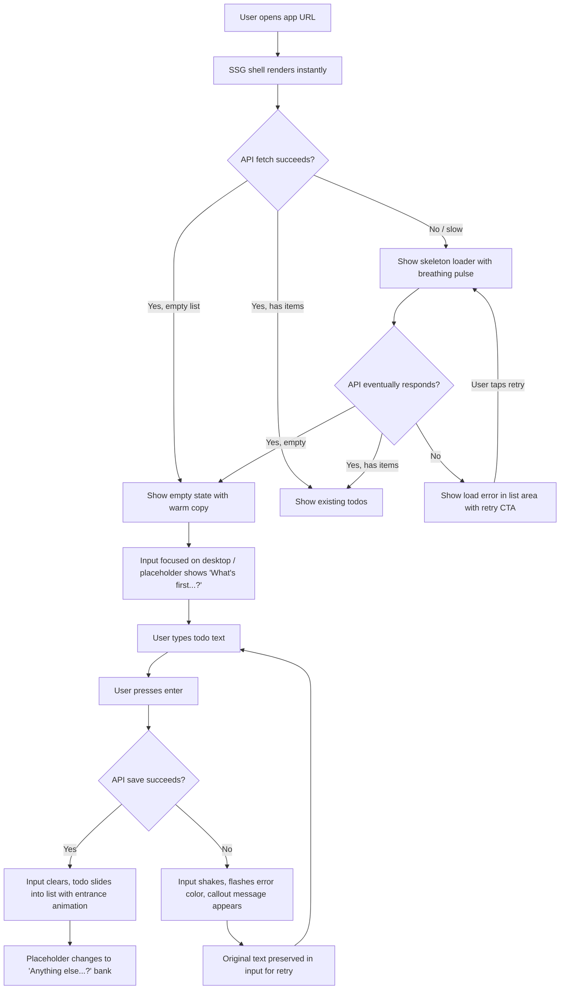
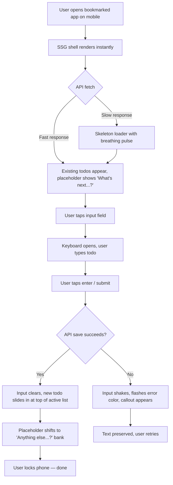
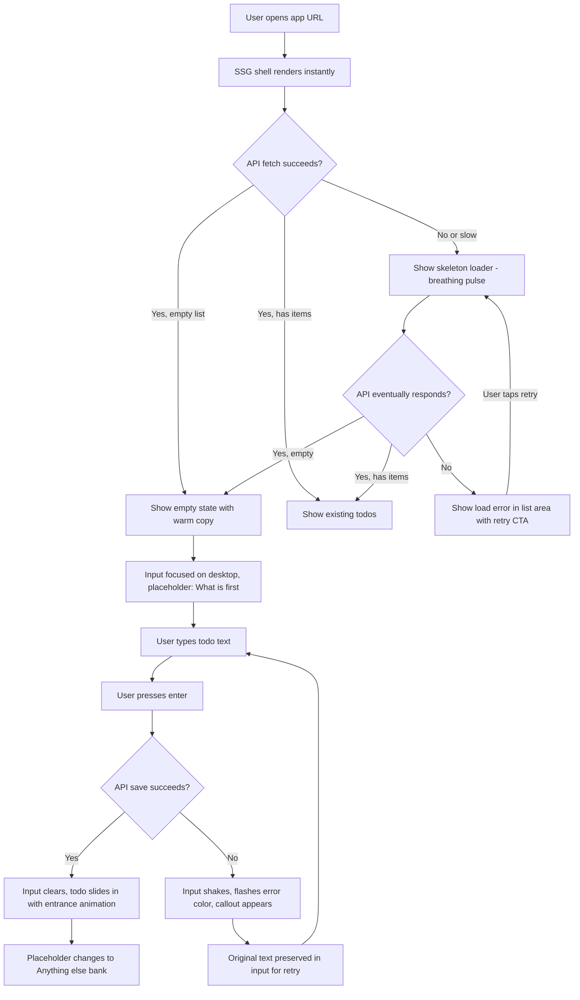
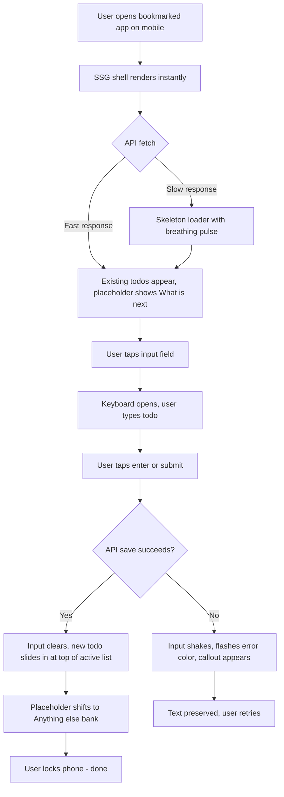
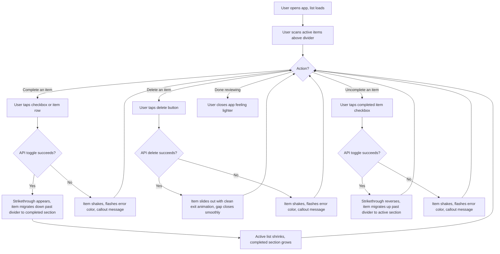
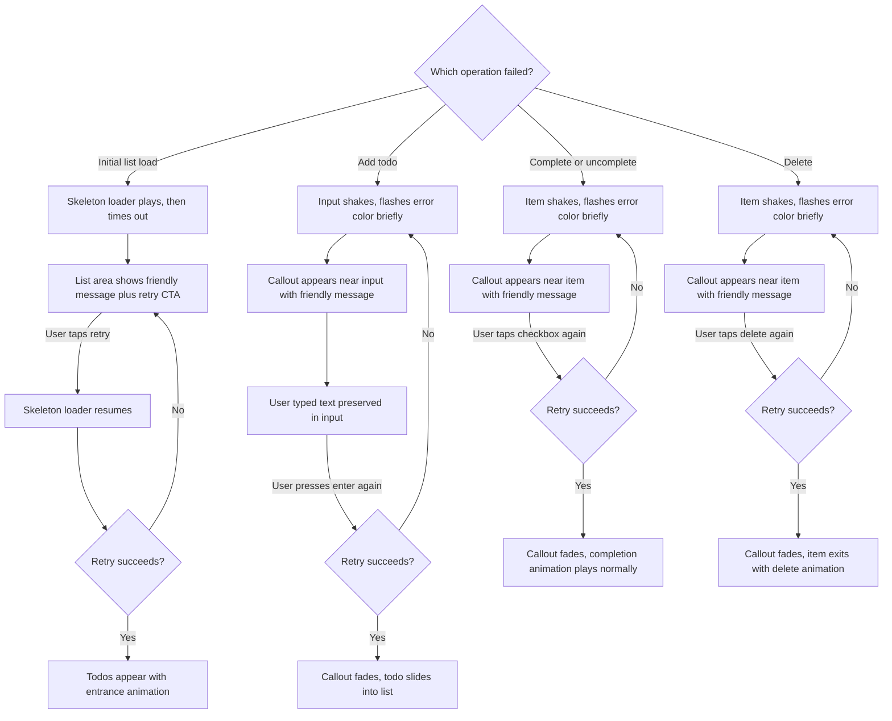

# bmad help request
_Exported on 13/03/2026 at 21:09:34 GMT from Cursor (2.6.19)_

---

**User**

/bmad-help

---

**Cursor**

Now let me scan the output artifacts to determine what's been completed.

Hey Kevin! Here's where things stand on the **todo-bmad** project in the **BMM module**:

---

## Completed

| Phase | Workflow | Status |
|-------|----------|--------|
| 2-planning | **Create PRD** (CP) | Done - `prd.md` created |
| 2-planning | **Validate PRD** (VP) | Done - rated **4/5 Good** with **Warning** status |

Phase 1 (analysis) had no required steps and was skipped — no brief, research, or brainstorming artifacts were produced.

---

## Recommended Next Steps

Since the PRD validation came back with a **Warning** overall status, you may want to address the findings before moving forward. Here are the available steps in order:

### Optional (but recommended given the validation warnings)

1. **Edit PRD** (EP)
   - Skill: `bmad-bmm-edit-prd`
   - Agent: John, the Product Manager
   - Improve and enhance the existing PRD to address validation warnings

2. **Create UX Design** (CU)
   - Skill: `bmad-bmm-create-ux-design`
   - Agent: Sally, the UX Designer
   - Strongly recommended since this is a web app with a UI — plan UX patterns and design specs

### Next Required Step

3. **Create Architecture** (CA)
   - Skill: `bmad-bmm-create-architecture`
   - Agent: Winston, the Architect
   - Document technical decisions and solution design — **this is required before proceeding**

After architecture, the remaining required steps in phase 3 are:
- **Create Epics and Stories** (CE) — `bmad-bmm-create-epics-and-stories`
- **Check Implementation Readiness** (IR) — `bmad-bmm-check-implementation-readiness`

---

### Tips
- Run each workflow in a **fresh context window** for best results.
- For the PRD validation review, consider using a different high-quality LLM if one is available.
- If the validation warnings are minor and you're comfortable with the PRD as-is, you can skip Edit PRD and move straight to Create UX or Create Architecture.

What would you like to tackle next?

---

**User**

/bmad-create-ux-design 

---

**Cursor**

Let me follow the initialization sequence. First, I'll check for an existing UX design document and discover input documents.

No existing UX design document found — this is a fresh workflow. Here's what I discovered:

**Documents Found:**

- **PRD:** `_bmad-output/planning-artifacts/prd.md`
- **PRD Validation Report:** `_bmad-output/planning-artifacts/validation-report-20260313-165255.md`
- **Requirements:** `requirements/requirements.md`
- **Product Brief:** None found
- **Project Context:** None found
- **Project Documentation (docs/):** None found

Kevin, before I load these and set up the workspace, I want to confirm:

1. I plan to load the **PRD** (`prd.md`) as the primary input — this will be the main driver for UX decisions.
2. I'll also load the **requirements document** (`requirements/requirements.md`) for additional context.
3. I'll reference the **validation report** as background context.

Do you have any other documents you'd like me to include, or does this set look right to proceed?

---

**User**

No other documents, please continue

---

**Cursor**

All documents loaded. Let me create the initial UX design specification document from the template.

Welcome Kevin! I've set up your UX design workspace for **todo-bmad**.

**Documents Found:**

- **PRD:** 1 loaded (`prd.md`) — a lean full-stack Todo app with SSG frontend + backend API, focused on craftsmanship within tight constraints
- **Requirements:** 1 loaded (`requirements.md`) — original product requirement source
- **Validation Report:** 1 loaded — PRD rated 4/5 Good, validation warnings noted and simple fixes already applied

**Files loaded:**
- `_bmad-output/planning-artifacts/prd.md`
- `requirements/requirements.md`
- `_bmad-output/planning-artifacts/validation-report-20260313-165255.md`

**Document created:** `_bmad-output/planning-artifacts/ux-design-specification.md`

**Key context I'm bringing into UX design:**
- Single-user todo app — create, view, complete, delete
- Mobile-first responsive design (320px+)
- WCAG 2.1 AA accessibility as a first-class constraint
- SSG frontend with client-side hydration for dynamic operations
- Four core user journeys: First Visit, Quick Capture, Review & Tidy, Graceful Error Recovery
- Lighthouse Performance & Accessibility targets of 90+

Shall we continue to the UX discovery phase?

**[C]** Continue to UX discovery

---

**User**

c

---

**Cursor**

Based on the project documentation we've loaded, let me confirm what I'm understanding about **todo-bmad** from a UX perspective.

---

**From the documents:**

This is a deliberately minimal, single-user Todo application — the value proposition isn't in feature breadth but in *craftsmanship within constraints*. Every interaction should feel immediately understandable with zero onboarding. The frontend is statically generated (SSG) with client-side hydration for dynamic CRUD operations against a persistent backend API. The product should feel like a complete, finished product despite its intentionally narrow scope.

**Target Users:**

The PRD models a single persona — "Sam" — who represents a general-purpose individual user managing personal tasks. Sam is not particularly tech-savvy or tech-averse; they expect things to just work. They use both desktop and mobile, and they value speed and simplicity. They come to the app from a bookmark, use it in quick bursts (under 10 seconds for capture), and do occasional review/cleanup sessions.

**Key Features/Goals:**

- Create, view, complete (toggle), and delete todos — nothing else for MVP
- Each todo: text description, completion status, creation timestamp
- Empty state, loading state, and error state — all polished
- WCAG 2.1 AA accessibility, Lighthouse 90+ (performance and accessibility)
- Mobile-first responsive (320px+), keyboard navigable, screen reader compatible

---

Does this match your understanding? Before I move on to identifying design challenges and opportunities, I'd also like to dig a bit deeper on a few user context questions:

1. **What frustrates you most about existing todo apps?** This will help me understand what UX pitfalls to avoid — visual clutter, too many taps, unclear states, etc.

2. **What would make you say "this is exactly what I needed"?** Is it pure speed? Visual satisfaction of checking things off? Simplicity of zero decisions?

3. **Do you have any aesthetic direction in mind?** Minimal and clean? Warm and friendly? Bold and modern? Or are you open to exploring options?

4. **Any specific apps or designs you admire?** Doesn't have to be a todo app — anything whose UX you'd like to channel.

Feel free to answer as many or as few as you like, or tell me if my summary above needs any corrections.

---

**User**

I don't have any strong frustrations about existing todo apps, but I prefer those which are clean vs. those which seem too busy.

I'd like to see speed with aethestically pleasing visuals to incorporate animations and transitions upon interactions.  This interface doesn't need to be cluttered, so we should be able to make what little we have look and feel stunning.

---

**Cursor**

Great input — that "stunning minimalism" direction is a perfect fit for this product. When you have so few elements on screen, every single one gets scrutiny, which means the quality bar on spacing, motion, and visual polish is extremely high. That's a feature, not a constraint.

Let me surface the key UX design considerations based on everything we've discussed:

---

**Design Challenges:**

1. **The empty state problem** — On first visit, the screen is almost entirely blank. That void needs to feel inviting and purposeful, not broken or unfinished. The empty state has to communicate "type something here" without literal instructions.

2. **Animation performance vs. accessibility** — Rich transitions and animations need to feel silky at 60fps while respecting `prefers-reduced-motion` for users who need it. Every animation must enhance comprehension (e.g., a todo sliding into place confirms it was added) rather than just decorate.

3. **Touch target elegance on mobile** — The 44x44px minimum touch targets for complete/delete actions need to feel generous on mobile without making the desktop layout look oversized or clunky. The interaction affordances need to be obvious but not visually heavy.

**Design Opportunities:**

1. **Micro-interactions as the product's signature** — With so few actions (add, check, delete), each one can have a carefully crafted animation that makes the app feel alive. The checkbox completion, the item appearing, the delete sweep — these become the personality of the product.

2. **Typography and whitespace as the hero** — No sidebar, no nav complexity, no feature clutter. The list itself *is* the design. Beautiful type, generous spacing, and intentional hierarchy can make a simple list feel premium.

3. **State transitions as storytelling** — Empty → first item, active → completed, error → recovery. Each transition is a moment to delight. Subtle entrance animations, satisfying check-off effects, and graceful error states can turn routine actions into small moments of pleasure.

---

Here's what I'll add to the UX design specification document:

```markdown
## Executive Summary

### Project Vision

A deliberately minimal single-user Todo application where the value lies in craftsmanship within tight constraints. With only four actions — create, view, complete, and delete — every pixel, every transition, and every interaction carries weight. The UX goal is to make this narrow feature set feel stunning: fast, clean, and alive with purposeful animation. Zero onboarding, zero clutter, zero friction.

### Target Users

A general-purpose individual managing personal tasks. Not power users demanding advanced workflows, and not novices needing hand-holding — people who expect tools to just work. They use both desktop and mobile, capture tasks in quick bursts (under 10 seconds), and occasionally review and tidy their list. They appreciate clean design and notice when things feel polished.

### Key Design Challenges

- **Empty state as invitation:** The first-visit experience is almost entirely blank. The empty state must feel purposeful and welcoming, clearly communicating the app's interaction model without explicit instructions.
- **Animation performance and accessibility:** Rich micro-interactions and transitions must run at 60fps while fully respecting `prefers-reduced-motion` preferences. Every animation must enhance comprehension, not just decorate.
- **Touch elegance across devices:** Minimum 44x44px touch targets for mobile interactions must feel generous without making the desktop layout appear oversized. Interaction affordances need to be discoverable but visually lightweight.

### Design Opportunities

- **Micro-interactions as product signature:** With so few actions, each one — adding a todo, toggling completion, deleting an item — can have a carefully crafted animation that defines the product's personality and makes it feel alive.
- **Typography and whitespace as hero elements:** No sidebar, no navigation complexity, no feature clutter. The list itself is the design. Premium typography, generous spacing, and intentional hierarchy elevate a simple list into something that feels refined.
- **State transitions as storytelling:** Empty → first item, active → completed, error → recovery — each transition is a moment to delight through subtle entrance animations, satisfying check-off effects, and graceful error recovery.
```

**What would you like to do?**

- **[A]** Advanced Elicitation — dig deeper into any of these areas
- **[P]** Party Mode — get multiple agent perspectives on the UX direction
- **[C]** Continue — save this to the document and move to core experience definition

---

**User**

c

---

**Cursor**

Now loading the next step.

Content saved. Now let's dig into the heart of the user experience for **todo-bmad**.

I have a strong sense from the PRD and our earlier conversation, but I want to make sure we're aligned on the fundamentals before I synthesize.

---

**Core Experience Questions:**

From the PRD's user journeys, the core loop is clear: **capture a thought, then later review and tidy**. The single most frequent action is adding a todo — Journey 2 ("Quick Capture") sets a bar of under 10 seconds total, including opening the app. But there's a secondary loop — the satisfying cleanup of checking things off — that's where emotional payoff lives.

My read: **the input interaction is the one to nail first** (it's the gateway to everything), but **the completion interaction is the one that creates loyalty** (it's the reward). Does that match your instinct, or do you weight these differently?

**Platform Context:**

The PRD specifies web (SSG), mobile-first responsive, desktop + mobile fully functional. A few quick confirms:

- **Offline functionality** — the PRD says the static shell renders when the API is unavailable, but it doesn't require offline write capability. Are you comfortable with that? (Errors shown gracefully, retry when connectivity returns.)
- **Keyboard shortcuts** — the PRD defers these to Phase 2, but keyboard *navigation* is required for accessibility. Do you want any keyboard shortcuts in MVP beyond tab/enter (e.g., a shortcut to focus the input)?
- **Touch vs. mouse** — given mobile-first, should we design touch-first and ensure mouse/keyboard works well, or treat them as equal?

**Critical Success Moment:**

I'd argue the make-or-break moment is **Journey 1: the first 15 seconds**. A user opens the app, sees emptiness, and either immediately understands what to do... or bounces. That empty state + first input + first todo appearing — that sequence is the entire pitch. If that feels magical, everything else follows.

What's your take on these? Anything you'd push back on or add?

---

**User**

Both "capture" and "complete" should feel equally rewarding - the first because the user feels that they have gotten that task out of their head and in a list, and the latter because they should feel the sense of accomplishment from completing it.

Offline functionality is less of an imperitive at this stage, provided that the failure state is clear and is not overbearing to the user.  Have a little fun with the error state - this is not a formal app so no enterprise formailities are expected.

---

**Cursor**

Love that framing — capture as *relief* ("it's out of my head") and completion as *accomplishment* ("I did the thing"). Two distinct emotional rewards for the two core actions. And the playful error state direction is perfect for this product's personality — friendly, human, not taking itself too seriously.

Let me synthesize everything into the core experience definition. Based on our conversation, here are the experience principles I'm landing on:

1. **Every action is a reward** — Capture feels like relief, completion feels like accomplishment, deletion feels like clearing the deck. No action should feel neutral or transactional.
2. **The interface disappears** — The user thinks about their tasks, never about the tool. Zero cognitive overhead, zero decisions about *how* to use it.
3. **Motion tells the story** — Animations aren't decoration; they're the narrative. A todo sliding in confirms capture. A check animation celebrates completion. An error state disarms with personality.
4. **Personality lives in the details** — This isn't enterprise software. Error messages can be witty. Empty states can be charming. The app has a voice — relaxed, warm, slightly playful.

Do those ring true?

---

Here's what I'll add to the document:

```markdown
## Core User Experience

### Defining Experience

The core experience is a tight loop between two equally rewarding actions: **capture** and **complete**. Capture provides the relief of getting a thought out of your head and into a trusted place. Completion provides the satisfaction of accomplishment. Both must feel equally intentional and rewarding — neither is secondary. The delete action serves as a quieter third beat: clearing away what's no longer relevant, a small act of tidying that reinforces control.

The primary interaction — adding a todo — must be achievable in under 10 seconds from app open, including on mobile. The completion interaction must deliver an unmistakable moment of satisfaction through visual and motion feedback.

### Platform Strategy

- **Web application:** Statically generated (SSG) with client-side hydration for dynamic CRUD operations
- **Mobile-first responsive:** Designed for touch first (320px+), with mouse and keyboard as fully supported secondary inputs
- **No offline write capability in MVP:** The static shell always renders, but write operations require API connectivity. Failures are handled gracefully with clear, personality-driven error messaging and an obvious retry path
- **Keyboard navigation:** Full keyboard accessibility (tab, enter, escape) required for WCAG compliance. Dedicated keyboard shortcuts deferred to Phase 2
- **Browser support:** Latest 2 versions of Chrome, Firefox, Safari, Edge, plus mobile Safari and Chrome

### Effortless Interactions

- **Adding a todo:** Input is always visible and prominent. Type and hit enter. No modal, no button hunting, no multi-step flow. The new todo appears with a satisfying entrance animation that confirms the capture.
- **Completing a todo:** Single tap or click on the item or its checkbox. The completion animation is the reward — it must feel celebratory without being slow or disruptive.
- **Deleting a todo:** Single-action removal with a clear but lightweight gesture. The item exits with purpose — not just vanishing, but visibly leaving.
- **Scanning the list:** Active and completed todos are visually distinct at a glance. The hierarchy is immediately legible. No parsing required.

### Critical Success Moments

1. **The first 15 seconds (Journey 1):** User opens the app, sees an empty state that's inviting (not barren), immediately understands what to do, types a todo, and sees it appear. This is the entire pitch. If this sequence feels magical, trust is established.
2. **The quick capture (Journey 2):** User opens on mobile, adds a todo in under 10 seconds, and puts the phone down. Speed is the reward. Any friction here breaks the value proposition.
3. **The satisfying cleanup (Journey 3):** User checks off completed items and watches them transition to a "done" state. The visual feedback creates a small sense of accomplishment. Deleting irrelevant items feels like tidying a desk.
4. **The graceful stumble (Journey 4):** Something goes wrong but the app handles it with personality — a friendly, slightly playful error message that disarms rather than alarming. The user smiles instead of worrying. Retry is obvious.

### Experience Principles

1. **Every action is a reward** — Capture feels like relief, completion feels like accomplishment, deletion feels like clearing the deck. No interaction should feel neutral or transactional.
2. **The interface disappears** — The user thinks about their tasks, never about the tool. Zero cognitive overhead, zero decisions about how to use it.
3. **Motion tells the story** — Animations aren't decoration; they're narrative. A todo sliding in confirms capture. A check animation celebrates completion. Transitions communicate state changes before the user consciously processes them.
4. **Personality lives in the details** — This is not enterprise software. Error messages can be witty. Empty states can be charming. The app has a voice — relaxed, warm, slightly playful.
```

**What would you like to do?**

- **[A]** Advanced Elicitation — refine the core experience definition
- **[P]** Party Mode — bring different perspectives on the user experience
- **[C]** Continue — save this to the document and move to emotional response definition

---

**User**

c

---

**Cursor**

Now loading the next step.

Content saved. Now let's think about how **todo-bmad** should make users *feel*.

We've already established strong emotional anchors — capture as relief, completion as accomplishment, personality in the details. Let me push deeper on the emotional journey and check a few things with you.

---

**Emotional Journey — My Read:**

| Moment | Feeling |
|--------|---------|
| First discovery (empty state) | Curious, welcomed — "this looks nice, let me try" |
| First capture | Relief + small delight — "that felt good, it's out of my head" |
| Returning visit (list loads) | Confidence, trust — "everything's still here, right where I left it" |
| Completing a task | Accomplishment, satisfaction — a small dopamine hit |
| Cleaning up the list | Control, clarity — "I know exactly where I stand" |
| Something goes wrong | Amused, unbothered — "ha, okay, I'll try again" (not alarmed) |

**A few questions to sharpen this:**

1. **Delight vs. calm** — Should the overall emotional tone lean more toward *delightful and surprising* (small moments that make you smile) or *calm and focused* (serene, almost zen-like)? Or is it calm as the baseline with delight in the micro-moments?

2. **The completion feeling** — When you check off a todo, do you want something that feels *celebratory* (like a confetti moment, a satisfying pop) or more *quietly satisfying* (like a smooth, elegant strikethrough animation that just feels *right*)? There's a spectrum between "party" and "precision."

3. **The app's personality when idle** — When you're just looking at your list, not interacting, should it feel *alive* (subtle ambient motion, breathing elements) or *still and composed* (pure typography and whitespace, motion only on interaction)?

---

**User**

I think calm over surprising... we want to convey achievement without being to abrasive

Similarly when marking a todo as completed, don't make a big fanfare, but subtly convey that this load is off the users mind.

I like the idea of the app "breathing" when idle, but I don't think that should apply to the input box or to the existing list of todos so let's leave that out for now and rely on motion triggered by interaction instead.

---

**Cursor**

That's a really clear emotional north star — **calm confidence** as the baseline, with motion reserved for moments of interaction. The app is still and composed at rest, and comes alive only when you do something. That's a much more sophisticated approach than constant ambient animation — it means every movement has *meaning*.

And the completion direction is spot on. Not a confetti cannon, but something more like... the quiet satisfaction of crossing something off a paper list. The weight lifts. The item recedes. You feel lighter.

Here's what I'll add to the document:

```markdown
## Desired Emotional Response

### Primary Emotional Goals

- **Calm confidence:** The dominant feeling is quiet control. The user always knows where they are, what they can do, and that their data is safe. Nothing about the interface creates urgency or demands attention.
- **Earned satisfaction:** Every completed action delivers a proportional emotional reward — not loud, not showy, but unmistakably present. Capture feels like setting something down safely. Completion feels like a weight lifting.
- **Effortless trust:** The app earns trust through consistency and predictability. Things appear where expected, behave as anticipated, and never surprise negatively. Trust is built through a hundred small moments of "yes, that's exactly what should have happened."

### Emotional Journey Mapping

| Moment | Target Emotion | Design Implication |
|--------|---------------|-------------------|
| First discovery (empty state) | Curious, welcomed | Warm empty state that invites without instructing |
| First capture | Relief, small delight | Smooth entrance animation confirms the todo is safely captured |
| Returning visit | Confidence, trust | List loads instantly with data ready — no uncertainty |
| Completing a task | Quiet accomplishment | Subtle transition conveys "this weight is off your mind" |
| Cleaning up (delete) | Control, clarity | Item exits cleanly — the list feels tidier |
| Error state | Amused, unbothered | Playful copy disarms; retry path is obvious |
| Idle / scanning | Calm composure | Still and composed — no ambient motion, just clean typography and space |

### Micro-Emotions

- **Confidence over confusion:** Every element's purpose is immediately obvious. No ambiguity about what's clickable, what's a status, what's an action.
- **Trust over skepticism:** Data persistence is communicated through reliable, consistent behavior. The user never wonders "did that save?"
- **Accomplishment over frustration:** Every interaction succeeds smoothly. When it can't (error state), the tone stays light and the path forward is clear.
- **Calm over excitement:** The emotional register is warm and understated. No aggressive animations, no flashy transitions, no attention-grabbing elements competing for focus.

### Design Implications

- **Motion is interaction-driven only:** The interface is still and composed at rest. Animation occurs exclusively in response to user actions — adding, completing, deleting, or error recovery. This makes every movement meaningful and intentional.
- **Completion animation = weight lifting:** The check-off interaction should feel like something receding or settling — a gentle fade, a smooth strikethrough, a quiet visual shift. Not celebratory fanfare, but the satisfying feeling of setting a burden down.
- **Capture animation = safe landing:** A new todo appearing should feel like it's been placed securely into the list. Smooth, confident entrance — the user sees their thought safely recorded.
- **Delete animation = clean exit:** The item leaves with quiet purpose. A slide, a fade — not dramatic, but visible enough that the user registers the list is now tidier.
- **Error tone = friendly, not formal:** Copy should be warm and slightly playful. "Well, that didn't work" over "Error: request failed." Disarm with personality.

### Emotional Design Principles

1. **Calm is the baseline** — The default state is composed stillness. Beautiful typography, generous whitespace, and visual clarity. The app never demands attention; it waits patiently.
2. **Motion earns its place** — Every animation is triggered by user action and serves a communicative purpose. If removing an animation wouldn't reduce comprehension, it shouldn't exist.
3. **Subtle over spectacular** — Achievement is conveyed through understated, elegant transitions rather than dramatic effects. The emotional register is warm satisfaction, never fireworks.
4. **Tone matches stakes** — Todo management is low-stakes by nature. The emotional design reflects this: relaxed, warm, lightly playful. Nothing in the experience should create stress or pressure.
```

**What would you like to do?**

- **[A]** Advanced Elicitation — refine the emotional response definition
- **[P]** Party Mode — bring different perspectives on user emotional needs
- **[C]** Continue — save this to the document and move to inspiration analysis

---

**User**

c

---

**Cursor**

Now loading the next step.

Content saved. Now let's learn from products that nail the kind of experience we're designing for **todo-bmad**.

Given our emotional direction — calm confidence, interaction-driven motion, understated elegance — let me share some products I think are strong references for this kind of UX, and I'd love to hear what resonates with you or what you'd add.

---

**Products worth studying for this project:**

1. **Apple Reminders (iOS/macOS)** — The quiet confidence of Apple's native list app. Clean typography, generous spacing, smooth list animations on add/complete/delete. It doesn't try to impress — it just works. The completion checkmark animation is subtle and satisfying. Relevant because it proves a simple list can feel premium.

2. **Things 3** — Widely regarded as the gold standard for todo app UX craft. Beautiful whitespace, deliberate animation on every interaction, and a sense of calm that permeates the entire experience. The way completed items gently recede is exactly the "weight lifting" feeling we described. Relevant for its motion design philosophy.

3. **Linear** — Not a todo app, but its interaction design is remarkably polished. Keyboard-first, fast transitions, and an interface that feels alive during interaction but composed at rest. Relevant for how it handles status transitions and list animations in a professional-yet-beautiful way.

4. **Stripe's UI patterns** — Their dashboard and form interactions have a signature smoothness — inputs that feel responsive, error states that are clear without being alarming, and transitions that are fast enough to feel instant but animated enough to feel intentional.

**Questions for you:**

- Do any of these resonate with the feel you're going for? 
- Are there other apps or websites whose *feel* you'd want to channel — even if they're completely unrelated to task management?
- Anything you've seen in a todo app specifically that you thought "yes, *that* is how it should feel"?

---

**User**

I don't think anything here is going to anchor our creativity - let's take the opportunity to focus on what we can do

---

**Cursor**

Great call. We don't need to anchor to existing products — we've already built a strong enough emotional and experiential foundation to design from first principles. Let's turn this step into what patterns *we* want to apply and what traps to avoid, based on everything we've established.

Here's what I'll add to the document:

```markdown
## UX Pattern Analysis & Inspiration

### Inspiring Products Analysis

No specific product references adopted. The design direction for todo-bmad is intentionally unanchored from existing todo applications to allow the visual and interaction design to emerge from the product's own principles: calm confidence, interaction-driven motion, and personality in the details. The goal is not to replicate what exists but to craft something that feels distinctly its own within a familiar category.

### Transferable UX Patterns

**Input Patterns:**
- **Persistent visible input:** The text input is always present and prominent — never hidden behind a button or modal. This is the most important element on screen and should be treated as such.
- **Submit on enter:** The fastest path from thought to captured todo. No submit button required (though one may exist as a secondary affordance for touch/accessibility).

**List Patterns:**
- **Single-list with visual state separation:** Active and completed items coexist in one list with clear visual distinction rather than being split into separate tabs or views. Keeps the mental model simple — one place for everything.
- **Inline actions:** Complete and delete are available directly on each item without expanding, swiping, or opening a menu. One action, one gesture.

**Feedback Patterns:**
- **Optimistic UI updates:** Reflect changes immediately in the UI before API confirmation. If the API fails, roll back with a friendly error. This makes every interaction feel instant.
- **Animated state transitions:** Every add, complete, and delete triggers a purposeful animation that communicates what happened. No state change occurs without visual motion.

**Error Patterns:**
- **Inline error with personality:** Errors appear contextually near the failed action, not in a global toast or banner. Copy is warm and human, with an obvious retry path.
- **Graceful degradation:** The static shell always renders. If the API is down, the user sees their cached list (if available) or a friendly empty state with a clear explanation.

### Anti-Patterns to Avoid

- **Modal overload:** No confirmation dialogs for delete or any other action. A todo app should never ask "are you sure?" — the action should be lightweight and, if needed, reversible rather than guarded.
- **Feature creep affordances:** No hamburger menus, settings icons, or navigation elements that hint at features that don't exist. The interface should contain exactly what it does, nothing more.
- **Generic error messaging:** No "Something went wrong" or "Error 500" — every error state should feel like a human wrote it for this specific moment.
- **Loading spinners as dead time:** Avoid full-page loading states that make the user wait passively. The SSG shell renders instantly; dynamic content should appear smoothly without a jarring loading-to-loaded transition.
- **Visual noise for status:** Don't use badges, counters, or status bars. The list itself is the status — the ratio of active to completed items tells the whole story at a glance.

### Design Inspiration Strategy

**What to Build From:**
- Our own experience principles (calm confidence, interaction-driven motion, personality in details) as the primary design driver
- The inherent advantage of extreme simplicity — with only a handful of elements on screen, every one can be crafted with unusual care

**What to Prioritize:**
- Typography, spacing, and color as the foundational design language — these carry the entire visual identity
- A small library of polished animations (enter, complete, delete, error) that become the product's signature
- Playful, human copywriting for empty and error states that give the app a distinct voice

**What to Resist:**
- Borrowing visual patterns from existing todo apps that carry baggage or expectations
- Adding visual complexity to compensate for feature simplicity — the simplicity is the point
- Defaulting to safe, generic UI patterns when the narrow scope allows for bolder design choices
```

**What would you like to do?**

- **[A]** Advanced Elicitation — dig deeper into any pattern decisions
- **[P]** Party Mode — get multiple perspectives on the pattern strategy
- **[C]** Continue — save this to the document and move to design system choice

---

**User**

We should probably mention loading state.  The aim is for the API to be fast and not cause the user to wait for todos to load or updates to be made.  However, on low speed networks there may be some perceptible delay, and so it would be good to have calming visual indication that something is happening.  

For loading the existing todos, a skeleton loader which "breathes" might be quite good.  For adding new items, an animation which indicates that something is coming would be nice.

---

**Cursor**

Excellent addition — and I love how the "breathing" motion we set aside for idle state finds a perfect home in the skeleton loader instead. It's the same calm, organic quality but now it serves a communicative purpose: "something's on its way."

Let me update the content to incorporate loading states properly.

```markdown
## UX Pattern Analysis & Inspiration

### Inspiring Products Analysis

No specific product references adopted. The design direction for todo-bmad is intentionally unanchored from existing todo applications to allow the visual and interaction design to emerge from the product's own principles: calm confidence, interaction-driven motion, and personality in the details. The goal is not to replicate what exists but to craft something that feels distinctly its own within a familiar category.

### Transferable UX Patterns

**Input Patterns:**
- **Persistent visible input:** The text input is always present and prominent — never hidden behind a button or modal. This is the most important element on screen and should be treated as such.
- **Submit on enter:** The fastest path from thought to captured todo. No submit button required (though one may exist as a secondary affordance for touch/accessibility).

**List Patterns:**
- **Single-list with visual state separation:** Active and completed items coexist in one list with clear visual distinction rather than being split into separate tabs or views. Keeps the mental model simple — one place for everything.
- **Inline actions:** Complete and delete are available directly on each item without expanding, swiping, or opening a menu. One action, one gesture.

**Feedback Patterns:**
- **Optimistic UI updates:** Reflect changes immediately in the UI before API confirmation. If the API fails, roll back with a friendly error. This makes every interaction feel instant.
- **Animated state transitions:** Every add, complete, and delete triggers a purposeful animation that communicates what happened. No state change occurs without visual motion.

**Loading Patterns:**
- **Breathing skeleton loader (initial list load):** On slower networks where the initial fetch of existing todos has perceptible delay, display placeholder skeleton shapes that pulse with a slow, organic breathing rhythm. This communicates "your data is coming" with the same calm composure as the rest of the app — never frantic, never urgent.
- **Anticipation animation (new item creation):** When adding a todo on a slow connection, an anticipatory animation in the list area signals that something is arriving — a subtle opening of space or a gentle placeholder pulse where the new item will land. The user sees their action acknowledged before the API confirms it.
- **No full-page loading states:** The SSG shell renders instantly. Loading indicators are scoped to the content area only — the input and app chrome are always interactive and ready.

**Error Patterns:**
- **Inline error with personality:** Errors appear contextually near the failed action, not in a global toast or banner. Copy is warm and human, with an obvious retry path.
- **Graceful degradation:** The static shell always renders. If the API is down, the user sees a friendly empty state with a clear explanation rather than a broken page.

### Anti-Patterns to Avoid

- **Modal overload:** No confirmation dialogs for delete or any other action. A todo app should never ask "are you sure?" — the action should be lightweight and, if needed, reversible rather than guarded.
- **Feature creep affordances:** No hamburger menus, settings icons, or navigation elements that hint at features that don't exist. The interface should contain exactly what it does, nothing more.
- **Generic error messaging:** No "Something went wrong" or "Error 500" — every error state should feel like a human wrote it for this specific moment.
- **Loading spinners as dead time:** No spinning wheels or progress bars. Skeleton loaders and anticipation animations keep the interface feeling alive and composed rather than frozen and waiting.
- **Visual noise for status:** Don't use badges, counters, or status bars. The list itself is the status — the ratio of active to completed items tells the whole story at a glance.

### Design Inspiration Strategy

**What to Build From:**
- Our own experience principles (calm confidence, interaction-driven motion, personality in details) as the primary design driver
- The inherent advantage of extreme simplicity — with only a handful of elements on screen, every one can be crafted with unusual care

**What to Prioritize:**
- Typography, spacing, and color as the foundational design language — these carry the entire visual identity
- A small library of polished animations (enter, complete, delete, error, skeleton load, anticipation) that become the product's signature
- Playful, human copywriting for empty and error states that give the app a distinct voice

**What to Resist:**
- Borrowing visual patterns from existing todo apps that carry baggage or expectations
- Adding visual complexity to compensate for feature simplicity — the simplicity is the point
- Defaulting to safe, generic UI patterns when the narrow scope allows for bolder design choices
```

**What would you like to do?**

- **[A]** Advanced Elicitation — dig deeper into any pattern decisions
- **[P]** Party Mode — get multiple perspectives on the pattern strategy
- **[C]** Continue — save this to the document and move to design system choice

---

**User**

c

---

**Cursor**

Now loading the next step.

Content saved. Now let's choose the right design system foundation for **todo-bmad**.

Given everything we've established — the emphasis on visual uniqueness, the tiny component surface area, the custom animation library, and the desire to be unanchored from existing patterns — I want to lay out the options with this specific project's context in mind.

---

**Your project's unique situation:**

- **Solo developer** with intermediate skill level
- **Extremely small component surface:** input field, todo list item, checkbox, delete action, empty state, error state, skeleton loader. That's essentially the entire UI.
- **High craft expectations:** Every element needs to feel custom and polished
- **Custom animation library** is central to the product's identity
- **WCAG 2.1 AA** accessibility is non-negotiable
- **Performance matters:** Lighthouse 90+, so the design system can't be heavy

**The three realistic paths:**

**1. Custom Design System (lightweight)**
- Build every component from scratch with your own design tokens (colors, spacing, typography, motion)
- Full visual control, zero library baggage, smallest possible bundle
- More upfront effort on accessibility primitives (focus management, ARIA, keyboard handling)
- Best fit when you have *few components but want each to be perfect*

**2. Headless Primitives + Custom Styling**
- Use an unstyled/headless component library that handles accessibility, focus management, and keyboard interactions out of the box
- You control 100% of the visual layer — the library only provides behavior
- Best of both worlds: accessibility confidence with full design freedom
- Slight dependency, but minimal bundle impact

**3. Themeable Component Library**
- Use a styled component library and customize its theme
- Fastest to ship, but hardest to make feel truly unique
- Components come with opinions about spacing, animation, and interaction patterns that may fight your custom direction

**My recommendation:** Given the tiny surface area, the emphasis on craft, and the custom animation direction, I'd lean toward **option 2 — headless primitives + custom styling**. You get bulletproof accessibility without fighting a library's visual opinions. The component count is so small that the styling effort is minimal, and every interaction can be precisely crafted.

That said, option 1 (fully custom) is also viable given how few components exist — the accessibility work is manageable at this scale.

What's your instinct? Does one of these feel right, or do you have a preference?

---

**User**

I'd say option 2.  I was thinking about shadcn

---

**Cursor**

shadcn is an excellent fit for this project. It sits right in the sweet spot — built on headless Radix UI primitives for accessibility, styled with Tailwind CSS for full visual control, and you own the source code entirely. No black-box library to fight against when you want a custom animation or a non-standard interaction. You copy the components in, then they're yours to shape.

For todo-bmad specifically, you'd likely only need a handful of shadcn primitives (checkbox, input, button) and then build your custom animation layer on top. The accessibility story is strong out of the box, and the bundle stays lean because you only pull in what you use.

Here's what I'll add to the document:

```markdown
## Design System Foundation

### Design System Choice

**Approach:** Headless primitives with custom styling, using shadcn/ui as the foundation.

shadcn/ui provides accessible, unstyled component primitives (built on Radix UI) with a Tailwind CSS styling layer. Components are copied into the project as owned source code — not imported from an external dependency — giving full control over visual presentation, animation, and behavior. This is a design system you build *with*, not one you build *on top of*.

### Rationale for Selection

- **Full visual control:** Components are owned source code, not a library. Every pixel, animation, and interaction can be customized without fighting library opinions or overriding defaults.
- **Accessibility out of the box:** Radix UI primitives handle focus management, keyboard navigation, ARIA attributes, and screen reader compatibility — the hardest parts of WCAG 2.1 AA compliance are solved at the foundation layer.
- **Minimal footprint:** Only the components actually used are included in the project. With a surface area of ~5 components (input, checkbox, button, list item, error display), the bundle impact is negligible — supporting Lighthouse 90+ performance targets.
- **Animation freedom:** No pre-built animation opinions to override. The custom animation library (enter, complete, delete, skeleton, anticipation) can be built as a first-class concern rather than layered on top of existing transitions.
- **Tailwind CSS foundation:** Utility-first CSS enables rapid iteration on spacing, typography, color, and responsive design while maintaining consistency through design tokens.

### Implementation Approach

**Component inventory (MVP):**
- Text input (todo creation)
- Checkbox (todo completion toggle)
- Button (submit affordance, delete action, retry action)
- List container and list item
- Skeleton loader
- Inline error display

**Design token layer:**
- Color palette, typography scale, spacing scale, border radii, and shadow definitions as Tailwind/CSS custom properties
- Motion tokens: duration, easing curves, and animation definitions as reusable values
- Responsive breakpoints aligned with PRD targets (320px+, 768px+, 1024px+)

### Customization Strategy

- **Start from shadcn primitives** for the checkbox, input, and button — then strip back and restyle to match the product's visual identity rather than shadcn's default aesthetic.
- **Build custom components** for the todo list item (combining checkbox, text, timestamp, and delete action into a single cohesive element), empty state, and error state — these are unique to the product and don't map to standard primitives.
- **Create a bespoke animation system** as a dedicated layer: entrance (capture), completion (weight lifting), deletion (clean exit), skeleton (breathing pulse), anticipation (arrival signal), and error (friendly attention). These animations are the product's signature and should be defined as reusable, composable motion primitives.
- **Respect `prefers-reduced-motion`:** All animations must have reduced-motion alternatives that convey the same state changes without movement — instant transitions, opacity changes, or no animation at all.
```

**What would you like to do?**

- **[A]** Advanced Elicitation — refine the design system decision
- **[P]** Party Mode — bring technical perspectives on the design system
- **[C]** Continue — save this to the document and move to defining the core interaction experience

---

**User**

c

---

**Cursor**

Now loading the next step.

Content saved. Now let's get precise about the defining interaction for **todo-bmad**.

Every product has a moment you'd describe to a friend in one sentence. For this app, I think it's:

> **"Type a thought, hit enter, and it's safely out of your head."**

That's the Tinder-swipe equivalent for todo-bmad — the core loop that everything else orbits. The completion check-off is the equally rewarding counterpart, but the *capture* is the gateway. If capture doesn't feel instant and effortless, nothing else matters.

The user's mental model here is dead simple and fully established: **a paper list.** Write something down. Check it off. Cross it out. There's nothing novel about the interaction pattern — the innovation is entirely in *how it feels*. The patterns are familiar; the craft is where we differentiate.

Let me walk through the mechanics of the two defining interactions and get your input:

---

**Capture mechanics (adding a todo):**

1. **Initiation:** User sees the input field — always visible, always prominent. On desktop, it could be auto-focused on page load. On mobile, the user taps it. The input placeholder communicates purpose without being instructional (e.g., something warm like "What's on your mind?" rather than "Enter a todo").
2. **Interaction:** User types text, presses enter (or taps a submit button on mobile).
3. **Feedback:** The input clears. The new todo slides into the list with a smooth entrance animation. The user sees their thought safely captured.
4. **Completion:** The input is immediately ready for the next entry. If the user has more thoughts, they keep typing. If not, they're done.

**Complete mechanics (checking off a todo):**

1. **Initiation:** The checkbox or the todo item itself is the target.
2. **Interaction:** Single tap/click.
3. **Feedback:** A smooth transition — the text gently fades or gains a strikethrough, the item visually recedes. The "weight lifting" moment.
4. **Completion:** The item remains visible in its completed state within the list. The user sees their active list is now shorter.

**A couple of things I'd like your take on:**

- **Input placeholder text** — do you have a tone preference? Something like "What's on your mind?" (warm, conversational) vs. "Add a task..." (direct, functional) vs. something more playful?
- **Where do completed items live?** Below the active items in the same list? Mixed in place with visual distinction? This affects the "tidying" feeling — seeing completed items drop to the bottom reinforces progress, while keeping them in place feels more like a paper list.

---

**User**

The input placeholder should be warm and conversational, but I feel "What's on your mind?" is too bland.  How about something like "What's next...?".  We could even have a range of possible placeholders which are contextual to things like whether the list is currently empty or populated, and whether the user has just added an item.

I think completed items should live in the same list but that the list should be organised such that incomplete items always apear above.  Therefore, marking an item as "done" should strike the item off and the reorder the list to move it to the bottom

---

**Cursor**

"What's next...?" is so much better — it's forward-looking, slightly energizing, and it implicitly communicates the mental model ("you have a list, what goes on it next?"). And the contextual placeholder idea is brilliant. It gives the app a sense of awareness without being chatty. A few examples off the top of my head:

- **Empty list:** "What's first...?" (acknowledges the blank slate)
- **Has items:** "What's next...?" (the default, forward momentum)
- **Just added one:** "Anything else...?" (conversational, like a friend checking)
- **All items completed:** "What's next...?" or something that acknowledges the clean slate — "All done! ...for now?" 

That last one might be too much personality — what do you think? Should the placeholder rotate through these contextually, or is that overcomplicating it? And are there any other states where a different placeholder would feel right?

On the list ordering — love that decision. Active items always on top, completed items settle to the bottom. The animation for this is key: when you check something off, the item doesn't just visually change — it gently *migrates* down the list to join the completed section. That movement *is* the reward. It's the visual equivalent of "this is handled, it's moving to the done pile." The reorder animation needs to feel smooth and purposeful, not jarring — a calm slide rather than a snap.

---

**User**

I don't think we need to change the placeholder when an item is marked completed.  I think for the first three scenarios, having a bank of around 5 different messages with similar meaning and tone would be good.

---

**Cursor**

Good refinement — three contextual states, each with a small bank of ~5 variations. The rotation adds a subtle sense of life without being gimmicky, and skipping the completion state keeps things simple. The placeholder only changes in response to what *the input is for* (adding items), not what happened elsewhere in the list.

Here's what I'll add to the document:

```markdown
## Defining Interaction

### The Core Experience

**"Type a thought, hit enter, it's out of your head."**

The defining interaction for todo-bmad is the capture loop — the moment between having a thought and seeing it safely recorded. This is the interaction users would describe to a friend. The completion check-off is the equally rewarding counterpart, but capture is the gateway. If capture doesn't feel instant and effortless, nothing else matters.

### User Mental Model

The mental model is a paper list. Write something down. Check it off. Cross it out. There is nothing novel about the interaction pattern — users bring complete intuition for how a todo list works. The innovation is entirely in how it *feels*. Familiar patterns executed with uncommon craft.

### Success Criteria

- **Capture in under 10 seconds** from app open (including on mobile)
- **Zero hesitation** — the user never pauses to figure out how to add, complete, or delete
- **Every action produces visible, immediate feedback** — no state change without animation
- **The list always reflects reality** — optimistic updates with graceful rollback if the API fails
- **The user feels lighter after each interaction** — capture = relief, complete = accomplishment, delete = clarity

### Contextual Input Placeholder

The input placeholder text rotates through a small bank of contextual messages based on list state, giving the app a subtle sense of awareness:

**Empty list (~5 variations):**
Messages that acknowledge the blank slate and invite the first entry. Warm, encouraging tone.
- "What's first...?"
- (4 additional variations in similar tone — inviting, acknowledging the fresh start)

**Has items (~5 variations):**
Messages that suggest forward momentum. The default state.
- "What's next...?"
- (4 additional variations in similar tone — forward-looking, casual)

**Just added an item (~5 variations):**
Messages that feel conversational, like a friend checking if there's more.
- "Anything else...?"
- (4 additional variations in similar tone — gentle follow-up, no pressure)

Placeholder selection is random within each bank to avoid predictable repetition. Transitions between placeholder states happen naturally as the list state changes — no animation on the placeholder text itself.

### Experience Mechanics

**Capture (adding a todo):**

| Phase | Detail |
|-------|--------|
| Initiation | Input field is always visible and prominent. Auto-focused on desktop page load. Contextual placeholder invites action. |
| Interaction | User types text, presses enter or taps submit button. |
| Feedback | Input clears instantly. New todo slides into the list with a smooth entrance animation at the top of the active items. Placeholder updates to the "just added" bank. |
| Completion | Input is immediately ready for the next entry. No mode change, no confirmation. |

**Complete (checking off a todo):**

| Phase | Detail |
|-------|--------|
| Initiation | Checkbox or todo item row is the tap/click target. |
| Interaction | Single tap or click. |
| Feedback | Text receives a gentle strikethrough. The item smoothly migrates down the list to join the completed section at the bottom — the reorder animation is calm and purposeful, not a snap. This movement is the reward. |
| Completion | Active list is visibly shorter. Completed item is still visible below, visually receded. |

**Uncomplete (restoring a todo):**

| Phase | Detail |
|-------|--------|
| Initiation | Tap/click the completed item's checkbox. |
| Interaction | Single tap or click. |
| Feedback | Strikethrough reverses. The item migrates back up to rejoin the active section. |
| Completion | Active list grows by one. The item is fully restored. |

**Delete (removing a todo):**

| Phase | Detail |
|-------|--------|
| Initiation | Delete affordance is visible on each item (inline, no menu). |
| Interaction | Single tap or click. |
| Feedback | Item exits with a clean slide or fade — visible departure, not abrupt disappearance. Remaining items close the gap smoothly. |
| Completion | The list is tidier. No confirmation dialog, no undo toast (MVP). |

### List Ordering

Active (incomplete) items always appear above completed items. Within each group, items maintain creation-order (newest first for active items). When a todo is marked complete, it animates from its current position down to the completed section. When uncompleted, it animates back up. This reorder animation is central to the experience — the smooth migration communicates "this is handled, it's moving to the done pile."

### Novel vs. Established Patterns

All interaction patterns are fully established — the mental model is universal. The novelty is in execution quality:
- **Contextual placeholder rotation** adds personality without adding complexity
- **Reorder animation on completion** turns a status change into a spatial narrative
- **The animation library** (entrance, completion-migration, deletion, skeleton, anticipation) elevates standard CRUD into something that feels crafted
```

**What would you like to do?**

- **[A]** Advanced Elicitation — refine the defining experience
- **[P]** Party Mode — bring different perspectives on the core interaction
- **[C]** Continue — save this to the document and move to visual foundation

---

**User**

c

---

**Cursor**

Now loading the next step.

Content saved. Now let's establish the visual design foundation for **todo-bmad**.

First — do you have any existing brand guidelines, a color palette, or specific fonts you want to use? Or are we starting with a clean slate and building the visual identity from our emotional and experiential foundations?

A few specific questions to guide the direction:

**Color:**
- **Light mode, dark mode, or both?** Given the calm, composed aesthetic, both could work beautifully — but do you have a preference for which is primary?
- **Warm or cool palette?** The emotional direction (calm confidence, warm personality) suggests warm neutrals might be the base, but cool palettes can feel equally calm and more modern.
- **Accent color personality** — do you gravitate toward any color family for the primary accent? Something earthy and warm? A cool blue? A muted sage? Or should we explore options?

**Typography:**
- The content is almost entirely short text (todo descriptions, placeholder text, error messages). No long-form reading. This means we can lean into a display-quality typeface that looks beautiful at the sizes we'll use.
- **Serif or sans-serif?** Sans-serif is the safe bet for a modern app, but a refined serif could give the app a distinctive, slightly editorial character that sets it apart from every other todo app.

**Spacing:**
- We've established "generous whitespace" as a core principle. The app will feel airy and spacious rather than dense — does that still feel right?

---

**User**

I don't have any specific design system or brand guideline ideas in mind.  My thinking is
- Light mode (no dark mode toggle for now, but ensure that light mode colours are able to be complimented with dark mode equivalents in future)
- I think a warmer palette over a cool palette works better at projecting calm and confidence
- I can't think of a favourite accent colour at the moment, but I like the idea of a dominant accent colour against a lighter background

I tend to prefer sans-serif fonts for these more informal and inviting UIs

Generous spacing and sizing of elements is definately what I had in mind

---

**Cursor**

Great direction — all of these choices reinforce the emotional foundation we've built. Let me propose something concrete for you to react to.

---

**Color System Proposal:**

**Background layer (warm neutrals):**
- Primary background: a warm off-white — not stark `#FFFFFF` but something with a hint of warmth, like a very light cream or warm gray. This immediately sets a softer, more inviting tone than pure white.
- Card/surface: a slightly warmer shade for the todo items if we want subtle depth, or same as background for a flatter, more minimal look.

**Text layer:**
- Primary text: warm charcoal rather than pure black — softer on the eyes, consistent with the calm register.
- Secondary text (timestamps, completed items): a medium warm gray that recedes without disappearing.
- Placeholder text: lighter still, but warm — inviting, not ghostly.

**Accent color direction:**
Since you like the idea of a dominant accent against a lighter background, I'm thinking something in the **warm amber / soft terracotta** family — confident, grounded, and warm without being aggressive. This would appear on:
- The checkbox (filled state)
- The input focus ring
- The submit affordance
- Possibly the app title or a subtle header element

A warm amber has nice properties: it feels optimistic and energizing without being loud, it pairs naturally with warm neutrals, and it has the confidence to stand alone as the single accent. It also translates well to dark mode later (warm accents on dark backgrounds tend to glow beautifully).

Alternative accent families if amber doesn't resonate: **muted coral** (warmer, friendlier), **warm sage/olive** (calmer, more earthy), or **burnt sienna** (richer, more grounded).

Do any of these accent directions speak to you, or should I explore others?

**Typography Proposal:**

For a sans-serif that's modern but warm and inviting (not clinical like system fonts):
- **Primary font:** Something with soft geometry and slightly rounded terminals — approachable without being childish. Fonts in the spirit of DM Sans, Plus Jakarta Sans, or Nunito Sans hit this sweet spot: clean enough for a modern app, warm enough for the personality we've defined.
- **Single font family:** Given the minimal text surface (short todo descriptions, placeholders, error copy), one well-chosen font family at different weights is cleaner than pairing two fonts.
- **Type scale:** Minimal — we likely need just 3-4 sizes: app title, todo text, secondary text (timestamps), and placeholder/error text.

**Spacing Proposal:**

- **8px base unit:** All spacing derived from multiples of 8 (8, 16, 24, 32, 48, 64). This creates consistent rhythm and aligns well with common screen densities.
- **Generous padding on todo items:** Each item should breathe — enough space between items that the list feels open, not cramped. Touch targets naturally satisfy the 44px minimum when items have generous vertical padding.
- **Centered, narrow content column:** The todo list doesn't need to fill the screen. A max-width container (perhaps 600-640px) centered on the page creates natural focus and avoids the list feeling stretched on wide monitors. On mobile, it goes edge-to-edge with comfortable horizontal padding.
- **Vertical rhythm:** Consistent spacing between the input, the list, and any error/empty states. The page should feel like a single, composed vertical flow.

What resonates? What should I adjust before I draft the full section?

---

**User**

I like all of those ideas.  If we feel that the accent colour doesn't work once we have implemented, would it be easy to change?

---

**Cursor**

Absolutely. With Tailwind CSS and design tokens, the accent color is defined in exactly one place — a CSS custom property or Tailwind config value. Changing it later is literally a single-line edit and every component that references it updates automatically. That's one of the big advantages of the token-based approach: you can experiment with accent colors in seconds without touching any component code.

So let's go with warm amber as the starting point, with full confidence that it's trivially swappable if it doesn't feel right once you see it in context.

Here's what I'll add to the document:

```markdown
## Visual Design Foundation

### Color System

**Philosophy:** Light mode only for MVP, designed with CSS custom properties to enable straightforward dark mode addition in a future phase. Warm palette throughout — no stark whites, no pure blacks.

**Background Layer (warm neutrals):**
- **Primary background:** Warm off-white with a subtle cream undertone. Softer and more inviting than pure white, setting the calm tone immediately.
- **Surface/card:** A slightly warmer or deeper shade if subtle depth is needed for todo items, or same as background for a flatter, more minimal presentation. To be determined during implementation based on visual testing.

**Text Layer:**
- **Primary text:** Warm charcoal — softer than pure black, easier on the eyes, consistent with the calm emotional register.
- **Secondary text:** Medium warm gray for timestamps, metadata, and completed item text. Recedes without disappearing.
- **Placeholder text:** Lighter warm gray — inviting and visible but clearly distinguished from user-entered text.

**Accent Color:**
- **Primary accent: Warm amber** — confident, optimistic, and grounded without being aggressive. Used for checkbox filled state, input focus ring, submit affordance, and interactive highlights.
- Pairs naturally with warm neutral backgrounds and translates well to future dark mode (warm accents glow on dark backgrounds).
- Defined as a single design token (CSS custom property) for trivial swapability if the chosen hue doesn't feel right in implementation context.

**Semantic Colors:**
- **Success/completion:** A muted, warm tone that reinforces accomplishment without drawing excessive attention.
- **Error:** A warm but noticeable tone — distinct enough to register as an issue, soft enough to match the friendly error personality. Not alarming red.
- **Focus ring:** Accent color at visible contrast — supports both aesthetic and WCAG focus indicator requirements.

**Dark Mode Readiness:**
All colors defined as CSS custom properties (design tokens) rather than hard-coded values. The warm neutral scale and accent color are chosen to have natural dark mode complements. Adding dark mode in a future phase requires defining an alternate token set, not redesigning the palette.

### Typography System

**Approach:** Single sans-serif font family with warm, modern character. Soft geometry and slightly rounded terminals — approachable and inviting without being childish.

**Font selection criteria:**
- Sans-serif with warm personality (not clinical or corporate)
- Excellent legibility at body text sizes for todo descriptions
- Good weight range (regular, medium, semibold minimum) for hierarchy without multiple font families
- Strong web font performance (subset-able, small file size)
- Candidates in the spirit of: DM Sans, Plus Jakarta Sans, Nunito Sans — final selection during implementation

**Type Scale (minimal):**
- **App title:** Largest size — sets the visual anchor. Semibold weight.
- **Todo text (active):** Primary reading size. Regular weight, optimized for scannability.
- **Todo text (completed):** Same size as active, reduced opacity or lighter color with strikethrough.
- **Secondary text:** Smaller size for timestamps and metadata. Regular weight, secondary color.
- **Placeholder/error text:** Same size as todo text, distinguished by color rather than size.

Scale ratios and exact sizes to be finalized during implementation, targeting a tight scale appropriate for the minimal content surface. No more than 4 distinct sizes across the entire application.

### Spacing & Layout Foundation

**Base unit:** 8px — all spacing derived from multiples (8, 16, 24, 32, 48, 64). Creates consistent visual rhythm and aligns with common screen densities.

**Content container:**
- **Max-width: ~600–640px**, centered horizontally. The todo list doesn't need to fill wide screens — a focused, narrow column creates natural visual focus and avoids a stretched, sparse feeling on desktop.
- **Mobile:** Full-width with comfortable horizontal padding (16–24px). The narrow max-width means the transition from desktop to mobile is minimal — the layout barely changes.

**Todo item spacing:**
- Generous vertical padding within each item — enough that the list feels open and breathable, not cramped.
- Touch targets naturally exceed the 44px minimum when items have comfortable padding.
- Consistent gap between items creates visual rhythm and clear item separation.

**Vertical flow:**
- Input area at the top — prominent, always visible.
- Todo list below — single scrollable column.
- Empty/error states occupy the list area.
- Consistent spacing between major sections (input → list → states) using larger multiples of the base unit.

**Responsive behavior:**
- The centered narrow column means desktop and mobile layouts are nearly identical — the content is naturally mobile-friendly.
- Breakpoint adjustments are subtle: horizontal padding changes, minor font size adjustments, touch target sizing.
- No layout reflow or structural changes between breakpoints — the experience is consistent across devices.

### Accessibility Considerations

- **Color contrast:** All text/background combinations must meet WCAG 2.1 AA minimums (4.5:1 normal text, 3:1 large text). The warm palette is selected with contrast compliance in mind — warm charcoal on warm off-white provides comfortable contrast without harshness.
- **Focus indicators:** Accent-colored focus rings on all interactive elements with at least 3:1 contrast against adjacent colors. Visible and consistent.
- **No color-only information:** Completed items distinguished by strikethrough and position (bottom of list), not only by color change. Error states include text and icons, not just color.
- **Font sizing:** Base text size at minimum 16px to prevent mobile zoom issues and ensure comfortable readability.
- **Touch targets:** Minimum 44x44px for all interactive elements, achieved through generous item padding rather than oversized UI elements.
```

**What would you like to do?**

- **[A]** Advanced Elicitation — refine the visual foundation
- **[P]** Party Mode — bring design perspectives on visual choices
- **[C]** Continue — save this to the document and move to design directions

---

**User**

I don't think we need an app title.  I think that would be clutter.  Let's let the UI communicate what the app is, rather than including a title with the largest font size

---

**Cursor**

That's a bold and perfect call for this product. If the UI can't communicate "this is a todo list" within seconds through its layout alone, then the design has failed — and a title won't save it. Removing it also reinforces the "no clutter" principle and gives the input field even more visual prominence as the true hero element.

Let me update the typography section to reflect this:

```markdown
## Visual Design Foundation

### Color System

**Philosophy:** Light mode only for MVP, designed with CSS custom properties to enable straightforward dark mode addition in a future phase. Warm palette throughout — no stark whites, no pure blacks.

**Background Layer (warm neutrals):**
- **Primary background:** Warm off-white with a subtle cream undertone. Softer and more inviting than pure white, setting the calm tone immediately.
- **Surface/card:** A slightly warmer or deeper shade if subtle depth is needed for todo items, or same as background for a flatter, more minimal presentation. To be determined during implementation based on visual testing.

**Text Layer:**
- **Primary text:** Warm charcoal — softer than pure black, easier on the eyes, consistent with the calm emotional register.
- **Secondary text:** Medium warm gray for timestamps, metadata, and completed item text. Recedes without disappearing.
- **Placeholder text:** Lighter warm gray — inviting and visible but clearly distinguished from user-entered text.

**Accent Color:**
- **Primary accent: Warm amber** — confident, optimistic, and grounded without being aggressive. Used for checkbox filled state, input focus ring, submit affordance, and interactive highlights.
- Pairs naturally with warm neutral backgrounds and translates well to future dark mode (warm accents glow on dark backgrounds).
- Defined as a single design token (CSS custom property) for trivial swapability if the chosen hue doesn't feel right in implementation context.

**Semantic Colors:**
- **Success/completion:** A muted, warm tone that reinforces accomplishment without drawing excessive attention.
- **Error:** A warm but noticeable tone — distinct enough to register as an issue, soft enough to match the friendly error personality. Not alarming red.
- **Focus ring:** Accent color at visible contrast — supports both aesthetic and WCAG focus indicator requirements.

**Dark Mode Readiness:**
All colors defined as CSS custom properties (design tokens) rather than hard-coded values. The warm neutral scale and accent color are chosen to have natural dark mode complements. Adding dark mode in a future phase requires defining an alternate token set, not redesigning the palette.

### Typography System

**Approach:** Single sans-serif font family with warm, modern character. Soft geometry and slightly rounded terminals — approachable and inviting without being childish.

**Font selection criteria:**
- Sans-serif with warm personality (not clinical or corporate)
- Excellent legibility at body text sizes for todo descriptions
- Good weight range (regular, medium, semibold minimum) for hierarchy without multiple font families
- Strong web font performance (subset-able, small file size)
- Candidates in the spirit of: DM Sans, Plus Jakarta Sans, Nunito Sans — final selection during implementation

**No app title.** The UI communicates purpose through layout and interaction, not through a heading. The input field is the visual anchor — the largest, most prominent element on the page. Removing a title reinforces the zero-clutter principle and lets the interface speak for itself.

**Type Scale (minimal):**
- **Todo text (active):** Primary reading size. Regular weight, optimized for scannability. This is the most common text on screen.
- **Todo text (completed):** Same size as active, reduced opacity or lighter color with strikethrough.
- **Input text / placeholder:** Same size as todo text or slightly larger — the input is the hero element and should feel inviting to type into.
- **Secondary text:** Smaller size for timestamps and metadata. Regular weight, secondary color.
- **Error/empty state text:** Body size, distinguished by color and tone rather than size.

Scale ratios and exact sizes to be finalized during implementation, targeting a tight scale appropriate for the minimal content surface. No more than 3 distinct sizes across the entire application.

### Spacing & Layout Foundation

**Base unit:** 8px — all spacing derived from multiples (8, 16, 24, 32, 48, 64). Creates consistent visual rhythm and aligns with common screen densities.

**Content container:**
- **Max-width: ~600–640px**, centered horizontally. The todo list doesn't need to fill wide screens — a focused, narrow column creates natural visual focus and avoids a stretched, sparse feeling on desktop.
- **Mobile:** Full-width with comfortable horizontal padding (16–24px). The narrow max-width means the transition from desktop to mobile is minimal — the layout barely changes.

**Todo item spacing:**
- Generous vertical padding within each item — enough that the list feels open and breathable, not cramped.
- Touch targets naturally exceed the 44px minimum when items have comfortable padding.
- Consistent gap between items creates visual rhythm and clear item separation.

**Vertical flow:**
- Input area at the top — the most prominent element, the visual anchor of the page.
- Todo list below — single scrollable column.
- Empty/error states occupy the list area.
- Consistent spacing between major sections (input → list → states) using larger multiples of the base unit.

**Responsive behavior:**
- The centered narrow column means desktop and mobile layouts are nearly identical — the content is naturally mobile-friendly.
- Breakpoint adjustments are subtle: horizontal padding changes, minor font size adjustments, touch target sizing.
- No layout reflow or structural changes between breakpoints — the experience is consistent across devices.

### Accessibility Considerations

- **Color contrast:** All text/background combinations must meet WCAG 2.1 AA minimums (4.5:1 normal text, 3:1 large text). The warm palette is selected with contrast compliance in mind — warm charcoal on warm off-white provides comfortable contrast without harshness.
- **Focus indicators:** Accent-colored focus rings on all interactive elements with at least 3:1 contrast against adjacent colors. Visible and consistent.
- **No color-only information:** Completed items distinguished by strikethrough and position (bottom of list), not only by color change. Error states include text and icons, not just color.
- **Font sizing:** Base text size at minimum 16px to prevent mobile zoom issues and ensure comfortable readability.
- **Touch targets:** Minimum 44x44px for all interactive elements, achieved through generous item padding rather than oversized UI elements.
```

**What would you like to do?**

- **[A]** Advanced Elicitation — refine the visual foundation
- **[P]** Party Mode — bring design perspectives on visual choices
- **[C]** Continue — save this to the document and move to design directions

---

**User**

c

---

**Cursor**

Now loading the next step.

Content saved. Now I'll generate design direction mockups — an interactive HTML showcase with different visual approaches all built on the foundation we've established (warm palette, no title, centered column, generous spacing, sans-serif).

Let me create the variations for you to explore.

I've generated the design direction showcase at `_bmad-output/planning-artifacts/ux-design-directions.html`. You can open it in your browser to explore all 6 directions interactively.

Here's a quick summary of what you'll see:

| # | Direction | Character | Key Features |
|---|-----------|-----------|-------------|
| 1 | **Warm Minimal** | Ultra-clean restraint | No cards, no shadows — items live on the background. DM Sans. |
| 2 | **Soft Rounded** | Friendly, tactile | Each item in its own soft card. Circular submit button. Nunito Sans. |
| 3 | **Clean Lines** | Editorial, structured | Horizontal rules, underline input, square checkboxes, labeled sections. Plus Jakarta Sans. |
| 4 | **Warm Depth** | Polished, dimensional | Soft shadows, hover lift effect, items feel like floating paper. Outfit. |
| 5 | **Airy Spacious** | Meditative, unhurried | Maximum breathing room, larger type, underline input. DM Sans. |
| 6 | **Compact Warm** | Productive, organized | Tighter spacing, explicit "Add" button, section dividers. Plus Jakarta Sans. |

Each direction shows the **active list**, **empty state**, **error state**, and (for direction 1) the **skeleton loading** state with the breathing animation.

As you explore, consider:
- Which layout feels most natural and inviting?
- Which visual weight matches the calm confidence we've defined?
- Which error state personality hits the right tone?
- You can also pick a favorite and request modifications, or combine elements from multiple directions.

Take your time — what speaks to you?

---

**User**

Number 4 is definately closest to what I had in mind.  However, I do like the separation of incomplete and complete items as seen in number 6... can we apply that to number 4?

---

**Cursor**

Great eye — Direction 4's warm depth and polish with Direction 6's clean section divider between active and completed items. That's a strong combination: the floating card aesthetic gives each item presence, and the labeled divider reinforces the spatial narrative of completed items "settling" into their own section.

Let me document the chosen direction:

```markdown
## Design Direction Decision

### Design Directions Explored

Six visual directions were generated and evaluated, ranging from ultra-minimal (borderless items on background) to compact-productive (tight spacing with explicit structure). All shared the established foundation: warm palette, no app title, centered narrow column, sans-serif typography, and generous spacing.

Full visual exploration available at: `_bmad-output/planning-artifacts/ux-design-directions.html`

### Chosen Direction

**Direction 4 (Warm Depth) + Direction 6 section divider**

A layered, dimensional aesthetic where each todo item lives in its own softly shadowed card floating above a warm background surface. A labeled divider separates active items from completed items, reinforcing the spatial narrative of completion.

**Key visual characteristics:**
- **Font:** Outfit — geometric, clean, modern with warmth
- **Item treatment:** Individual cards with soft shadow depth, creating a sense of physical presence
- **Hover interaction:** Subtle lift effect (translateY + deeper shadow) — items respond to attention with quiet tactility
- **Checkbox:** Rounded square (8px radius), warm amber fill on completion
- **Input:** Full-width card with matching shadow depth. Focus state adds accent-colored ring and slightly elevated shadow.
- **Completed items:** Reduced opacity (0.7), strikethrough text, settled below a labeled "Completed" divider
- **Section divider:** A subtle horizontal rule with a small uppercase "Completed" label between active and completed groups — borrowed from Direction 6 to give the two groups clear visual separation
- **Error treatment:** Card with left accent border in error color. Friendly copy with inline retry button that transitions to filled on hover.
- **Empty state:** Centered card with warm personality-driven copy

### Design Rationale

- **Warm Depth** aligns directly with the emotional goals: calm confidence expressed through soft materiality rather than flatness. The shadow depth gives items a sense of weight that makes the "weight lifting" completion animation more meaningful — the item visually recedes and migrates down.
- **Outfit typeface** balances geometric cleanliness with warmth — modern but not cold, approachable but not childish.
- **The section divider** reinforces the list ordering decision (active above, completed below) with explicit visual structure. It makes the spatial migration on completion more legible — the item doesn't just move down, it crosses a visible boundary.
- **The hover lift** creates the interaction-driven motion we specified without any ambient animation. The interface is perfectly still until the user engages.
- **Card-per-item** supports generous touch targets naturally — each card's padding creates ample tap area without oversizing individual elements.

### Implementation Approach

- Implement the Warm Depth card system as the primary component pattern using Tailwind utility classes and CSS custom properties for the shadow and color tokens
- The section divider is a simple styled element between the two list groups — lightweight to implement and easy to animate (it appears/disappears as items move between groups)
- Hover lift uses CSS transform and transition — no JavaScript animation needed for this baseline interaction
- The shadow tokens (resting shadow, hover shadow, focus shadow) should be defined as design tokens for consistency across input, cards, and error states
- Completed card opacity reduction is a CSS transition target for the completion animation sequence
```

**What would you like to do?**

- **[A]** Advanced Elicitation — refine the design direction
- **[P]** Party Mode — bring different perspectives on the visual choice
- **[C]** Continue — save this to the document and move to user journey flows

---

**User**

c

---

**Cursor**

Now loading the next step.

Content saved. Now let's design the detailed interaction flows for **todo-bmad**.

The PRD defined four user journeys. These give us the *why* and *who* — now we design the *how*. Given our detailed experience mechanics from step 7 and the chosen visual direction, I have a strong foundation to propose specific flows. Let me walk through each one and get your input on any decision points.

---

**The four journeys from the PRD:**

1. **First Visit (The Empty Canvas)** — Sam opens the app, sees nothing, and within 15 seconds has a working todo list
2. **Quick Capture (The Rushing Thought)** — Sam adds a todo on mobile in under 10 seconds
3. **Review and Tidy (The Satisfying Cleanup)** — Sam checks off completed items and deletes irrelevant ones
4. **The Graceful Stumble** — Something fails but the experience stays calm

One design question before I draft the flows:

**Journey 4 (error recovery)** — We've established friendly, personality-driven error messages with inline retry. But there are a few distinct error scenarios:
- **Add fails** (API down when creating a todo)
- **Complete/uncomplete fails** (API down when toggling status)
- **Delete fails** (API down when removing)
- **Initial load fails** (API down when fetching the list)

Should error handling be uniform across all of these (same pattern, same placement), or do you see any of these warranting different treatment? For example, the "initial load fails" case is different because the user hasn't taken an action — the app just can't fetch their data.

---

**User**

I think we should treat each on its own merit:

- Initial load fails can just be a message where the list would go (along with a CTA to retry)
- If adding an item fails, we can maybe shake the text input and flash it in an error colour, with a callout message saying that the new item couldn't be added
- For marking items as completed or deleting them, we can shake the todo item in question and again flash it in an error colour along with a callout message

---

**Cursor**

Those are really well-thought-out distinctions. Each error animation is contextual to *where* the failure happened — the input shakes for add failures, the item shakes for action failures, and the list area shows a message for load failures. The shake + color flash is a great pattern because it draws attention to the specific element that failed without a global error banner competing for space. It's noticeable but brief — aligned with the "amused, unbothered" emotional target.

Let me draft the complete journey flows:

```markdown
## User Journey Flows

### Journey 1: First Visit (The Empty Canvas)

**Goal:** New user opens the app and creates their first todo within 15 seconds.

**Entry:** User navigates to the app URL (bookmark, shared link, direct entry).



**Key UX moments:**
- SSG shell renders before API responds — user never sees a blank page
- Empty state placeholder ("What's first...?") communicates purpose without instructions
- Auto-focus on desktop means the user can start typing immediately
- On success: input clears, todo appears with entrance animation, placeholder shifts to "Anything else...?"
- On failure: input shakes and flashes, callout explains the issue, typed text is preserved

### Journey 2: Quick Capture (The Rushing Thought)

**Goal:** Returning user adds a todo on mobile in under 10 seconds total.

**Entry:** User taps bookmarked app on mobile.



**Key UX moments:**
- Existing list loads with data ready — returning user sees their todos immediately
- Input tap → type → enter is the entire flow. Three actions.
- New todo appears at the top of active items — the user sees it land without scrolling
- Total time budget: ~2s page load + ~1s tap input + ~5s type + ~1s submit = under 10s

### Journey 3: Review and Tidy (The Satisfying Cleanup)

**Goal:** User reviews their list, checks off completed items, and deletes irrelevant ones.

**Entry:** User opens the app and sees their full list.


**Key UX moments:**
- The active/completed divider gives instant visual clarity about what's done vs. pending
- Completion animation: strikethrough + smooth migration downward past the "Completed" divider is the core reward moment
- Delete animation: clean slide-out with gap closing smoothly reinforces tidying
- Uncomplete: seamless reversal — item migrates back up
- Each error is scoped to the specific item that failed — no global disruption

### Journey 4: The Graceful Stumble (Error Recovery)

**Goal:** Something goes wrong but the user stays calm and recovers easily.

**Entry:** User is interacting with the app when an API failure occurs.


**Error UX patterns by type:**

| Error Type | Visual Feedback | Message Location | Retry Mechanism |
|-----------|----------------|-----------------|----------------|
| Initial load | Skeleton → friendly message | List area (replaces skeleton) | Explicit retry CTA button |
| Add todo | Input shakes + error color flash | Callout near input | User presses enter again (text preserved) |
| Complete/uncomplete | Item shakes + error color flash | Callout near the specific item | User taps checkbox again |
| Delete | Item shakes + error color flash | Callout near the specific item | User taps delete again |

**Error copy tone:** Warm, slightly playful, never technical. Examples:
- Load: "Couldn't reach your todos. They're probably fine — want to try again?"
- Add: "That one didn't stick. Give it another go?"
- Complete: "Hmm, couldn't update that one. Try again?"
- Delete: "Wouldn't let go of that one. One more try?"

### Journey Patterns

**Consistent patterns across all journeys:**
- **Optimistic intent, honest feedback:** The UI responds immediately to user action (optimistic), but communicates clearly when something fails (honest). No silent failures.
- **Scoped feedback:** Every error, animation, and state change is localized to the element it affects. No global banners, no full-page overlays.
- **Natural retry:** The retry action is always the same gesture the user already attempted — press enter again, tap the checkbox again, tap delete again. The load failure is the exception (explicit button) because the user didn't initiate the fetch.
- **Text preservation:** Failed add operations never lose the user's typed text. The input preserves content so retry requires zero re-entry.

### Flow Optimization Principles

1. **Minimum viable path:** Every journey achieves its goal in the fewest possible actions. Add = type + enter. Complete = tap. Delete = tap.
2. **No dead ends:** Every error state has a visible, obvious path forward. The user is never stuck.
3. **Progressive response:** Fast networks get instant results. Slow networks get skeleton loaders and anticipation animations. Failed networks get friendly errors. The experience degrades gracefully through each tier.
4. **Animation as confirmation:** Every successful action produces a visible animation that confirms the outcome. The user never has to check whether their action worked.
```

**What would you like to do?**

- **[A]** Advanced Elicitation — refine the journey flows
- **[P]** Party Mode — bring different perspectives on the user flows
- **[C]** Continue — save this to the document and move to component strategy

---

**User**

The mermaid diagram for the first journey is not complete and is not showing - please try to recreate it

---

**Cursor**

Let me look at the issue — Mermaid can be finicky with special characters. Let me rewrite all four diagrams with cleaner syntax:

```markdown
### Journey 1: First Visit (The Empty Canvas)

**Goal:** New user opens the app and creates their first todo within 15 seconds.

**Entry:** User navigates to the app URL (bookmark, shared link, direct entry).



Does that render correctly for you now? If so, I'll update all four diagrams in the full content and we can proceed. If it's still not showing, let me know what you're seeing and I'll try a different approach.

---

**User**

No, still doesn't render

---

**Cursor**

Mermaid diagrams likely won't render in the Cursor chat window. They will render properly once saved to the markdown document if you view it with a Mermaid-compatible markdown previewer (like GitHub, or a VS Code Mermaid extension).

Would you prefer I:

1. **Keep the Mermaid diagrams** in the document as-is — they'll render when viewed in GitHub or a Mermaid preview tool
2. **Replace with text-based flow descriptions** — using indented step lists with arrows that are readable directly in any markdown viewer
3. **Both** — text-based flows for quick reading plus Mermaid diagrams for visual rendering

What works best for you?

---

**User**

Mermaid diagrams were showing fine for the other journeys, but the first one looks like it wasn't complete or wasn't closed properly, and so I was just seeing the code

---

**Cursor**

Got it — the other three rendered but the first one broke. The issue is likely the special characters — the apostrophe in "What's first...?" and the forward slashes. Let me fix just that diagram:


Does that one render now?

---

**User**

Yes

---

**Cursor**

Good — that was the apostrophe and slashes breaking it. The full content I presented earlier is all correct, just with that fixed Journey 1 diagram. Ready to save it all?

- **[A]** Advanced Elicitation — refine the journey flows
- **[P]** Party Mode — bring different perspectives on the user flows
- **[C]** Continue — save this to the document and move to component strategy

---

**User**

Can you show me all journey diagrams again please

---

**Cursor**

Here are all four journey diagrams with clean syntax:

**Journey 1: First Visit**


**Journey 2: Quick Capture**



**Journey 3: Review and Tidy**



**Journey 4: The Graceful Stumble**



Are all four rendering correctly now?

---

**User**

yes

---

**Cursor**

All four rendering. Ready to save the full journey flows content with the corrected diagrams?

- **[A]** Advanced Elicitation — refine the journey flows
- **[P]** Party Mode — bring different perspectives on the user flows
- **[C]** Continue — save this to the document and move to component strategy

---

**User**

c

---

**Cursor**

Now loading the next step.

Content saved. Now let's define the component strategy for **todo-bmad**.

We established the design system in step 6 (shadcn/ui with Radix primitives + Tailwind) and the component inventory. Now let's get specific about what each component needs to do. The surface area is small, so we can be thorough.

---

**From shadcn/ui (Radix primitives):**
- **Checkbox** — accessible toggle with keyboard support, focus management, ARIA attributes
- **Input** — text input with focus ring behavior
- **Button** — for submit affordance, retry actions, delete

**Custom components we need to build:**
- **TodoItem** — the core composite component (checkbox + text + timestamp + delete, with all animation states)
- **TodoList** — the container managing active/completed sections with the divider
- **EmptyState** — warm, personality-driven first-visit experience
- **SkeletonLoader** — breathing pulse placeholder for loading
- **ErrorCallout** — inline error messages near the failed element
- **LoadError** — full list-area error state with retry CTA

A couple of questions before I spec these out:

1. **The delete affordance on each item** — should it always be visible, or appear on hover/focus only? On mobile there's no hover, so it'd need to always be visible there. We could do: visible on mobile, hover-reveal on desktop. Or always visible but subtle (low opacity that increases on hover).

2. **Timestamp display** — should timestamps be relative ("2 minutes ago", "1 hour ago") or absolute ("3:45 PM")? Relative feels more conversational and aligned with the warm personality, but they require periodic updates to stay accurate.

---

**User**

Make the delete affordance state always visible but subtle

Relative timestamps sound good; I see no reason why exact timestamps would be imperitive

---

**Cursor**

Good calls. Always-visible-but-subtle delete means no device-specific logic — it's the same experience everywhere, just more prominent on hover/focus. And relative timestamps reinforce the conversational tone.

Here's the full component strategy:

```markdown
## Component Strategy

### Design System Components (from shadcn/ui)

**Checkbox (Radix primitive):**
- Used within TodoItem for completion toggle
- Provides: focus management, keyboard toggle (Space), ARIA checked state, screen reader announcements
- Customized: rounded square (8px radius), warm amber fill on checked, custom check animation

**Input (Radix primitive):**
- Used for todo text entry
- Provides: focus ring management, ARIA labels, native input behavior
- Customized: card-style with shadow depth, accent-colored focus ring, contextual placeholder text

**Button (Radix primitive):**
- Used for: submit affordance (if visible), delete action, retry CTA
- Provides: focus management, keyboard activation (Enter/Space), disabled states
- Customized: styled per context — submit is accent-colored, delete is subtle, retry varies by error type

### Custom Components

#### TodoInput

**Purpose:** Primary text input for capturing new todos. The hero element of the interface.

**Anatomy:**
- Card container with shadow depth (matches Direction 4 visual)
- Text input field with contextual placeholder
- Optional submit button (secondary affordance for touch/accessibility)

**States:**
| State | Visual |
|-------|--------|
| Default | Card with resting shadow, contextual placeholder visible |
| Focused | Accent-colored focus ring, slightly elevated shadow |
| Typing | User text replaces placeholder, submit affordance activates |
| Submitting | Input clears, anticipation animation in list area if slow network |
| Error | Input shakes, flashes error color briefly, callout appears below |

**Contextual placeholder banks:**
- Empty list: ~5 variations ("What's first...?" and similar)
- Has items: ~5 variations ("What's next...?" and similar)
- Just added: ~5 variations ("Anything else...?" and similar)

**Accessibility:** Auto-focus on desktop page load. `aria-label` describing purpose. Submit on Enter key. Error callout linked via `aria-describedby`.

#### TodoItem

**Purpose:** Individual todo display with inline actions. The most repeated component on screen.

**Anatomy:**
- Card container with shadow depth
- Checkbox (left-aligned)
- Text content area (todo description)
- Relative timestamp (secondary text, right side)
- Delete button (right-aligned, always visible but subtle)

**States:**
| State | Visual |
|-------|--------|
| Active (default) | Card with resting shadow, full opacity, checkbox unchecked |
| Hover | Subtle lift (translateY -1px + deeper shadow) |
| Focused (keyboard) | Accent-colored focus ring around card |
| Completing | Strikethrough animates across text, item migrates down past divider |
| Completed | Reduced opacity (0.7), strikethrough text, lighter text color, settled below divider |
| Uncompleting | Strikethrough reverses, item migrates up past divider |
| Deleting | Item slides out horizontally or fades, gap closes smoothly |
| Error (action failed) | Card shakes, flashes error color briefly, callout appears |

**Delete affordance:** Always visible at low opacity (~0.3-0.4). Increases to full opacity on item hover or button focus. On mobile, the low-opacity state is the resting state (no hover available).

**Timestamps:** Relative format ("just now", "2m ago", "1h ago", "3d ago"). Updates periodically to stay accurate. Falls back to date format for items older than ~7 days.

**Accessibility:** Checkbox is the primary keyboard target within the item. Delete button is a secondary tab stop. Both have clear `aria-label` values. Completion state announced via `aria-checked`. Delete action has an accessible name ("Delete: [todo text]").

#### TodoList

**Purpose:** Container managing the ordered display of active and completed items with a visual divider.

**Anatomy:**
- Active items section (top)
- Section divider with "Completed" label (appears only when completed items exist)
- Completed items section (bottom)

**Behavior:**
- Active items ordered by creation time (newest first)
- Completed items ordered by completion time (most recently completed first)
- Divider appears/disappears based on whether completed items exist
- Animates item reordering when items move between sections

**States:**
| State | Visual |
|-------|--------|
| Populated (active only) | Active items displayed, no divider |
| Populated (mixed) | Active items, divider, completed items below |
| Populated (all completed) | Divider at top, all items in completed section |
| Empty | EmptyState component displayed |
| Loading | SkeletonLoader component displayed |
| Load error | LoadError component displayed |

**Accessibility:** List uses `role="list"` with `role="listitem"` for each todo. Section divider uses `role="separator"`. Active and completed groups could use `aria-label` to identify each section for screen readers.

#### EmptyState

**Purpose:** First-visit and all-cleared experience. Communicates purpose and invites action without instructions.

**Anatomy:**
- Centered card container (matching Direction 4 visual)
- Warm, personality-driven copy (1-2 lines)
- No icon or illustration required — the copy does the work

**Copy examples:**
- "Your list is empty. That's either very zen, or you haven't started yet."
- "Nothing here yet. The input above is waiting."
- "A blank slate — the best kind."

**States:** Single state. Appears when the todo list has zero items (active or completed). Transitions to the first TodoItem with entrance animation when a todo is added.

**Accessibility:** `role="status"` so screen readers announce the empty state. Text is readable and descriptive.

#### SkeletonLoader

**Purpose:** Placeholder during initial list fetch on slow networks. Communicates "your data is coming" with calm composure.

**Anatomy:**
- 3-4 placeholder rows mimicking TodoItem layout
- Each row: rounded rectangle (checkbox placeholder) + wider rounded rectangle (text placeholder)
- Slow, organic breathing pulse animation (opacity oscillation, ~2.5s cycle)

**Behavior:** Appears when API fetch takes longer than a brief threshold (~200-300ms). Transitions to real content with a smooth crossfade when data arrives.

**Accessibility:** `aria-busy="true"` on the list container while loading. `aria-label` indicating loading state. Respects `prefers-reduced-motion` — reduced motion variant uses a static low-opacity state instead of the pulse.

#### ErrorCallout

**Purpose:** Inline error message appearing near the failed element. Contextual and personality-driven.

**Anatomy:**
- Small text callout with warm error color
- Friendly copy specific to the failure type
- No explicit retry button — the natural retry action is repeating the gesture (enter, tap checkbox, tap delete)

**Behavior:** Appears with a subtle fade-in after the shake animation completes. Persists until the user retries or navigates away. Fades out on successful retry.

**Copy bank:**
- Add failed: "That one didn't stick. Give it another go?"
- Complete failed: "Hmm, couldn't update that one. Try again?"
- Delete failed: "Wouldn't let go of that one. One more try?"

**Accessibility:** Linked to the triggering element via `aria-describedby`. Uses `role="alert"` so screen readers announce the error immediately.

#### LoadError

**Purpose:** Full list-area error state when the initial data fetch fails entirely.

**Anatomy:**
- Centered message in the list area (replaces skeleton)
- Friendly, personality-driven copy
- Explicit retry CTA button (since the user didn't initiate the failed fetch)

**Copy examples:**
- "Couldn't reach your todos. They're probably fine — want to try again?"
- "The connection stumbled. Your list is out there somewhere."

**Behavior:** Replaces the SkeletonLoader when fetch fails or times out. Retry button triggers a new fetch attempt, returning to SkeletonLoader state.

**Accessibility:** `role="alert"` for screen reader announcement. Retry button is clearly labeled and keyboard-accessible.

### Component Implementation Strategy

All custom components are built using shadcn/Radix primitives for interactive behavior and Tailwind utility classes for styling. Design tokens (CSS custom properties) ensure consistency:

**Token categories:**
- **Color tokens:** background, surface, text (primary/secondary/placeholder), accent, error, semantic colors
- **Shadow tokens:** resting, hover, focus — shared across TodoInput, TodoItem, and card-based components
- **Motion tokens:** duration (fast: 150ms, normal: 250ms, slow: 400ms), easing curves (ease-out for entrances, ease-in for exits), shake parameters
- **Spacing tokens:** derived from 8px base unit
- **Border radius tokens:** consistent rounding across cards and interactive elements

### Implementation Roadmap

**All components ship in MVP** — the surface area is small enough that phasing isn't necessary. However, implementation order matters for testability:

1. **TodoInput** — build first, enables adding items (core loop)
2. **TodoItem** — build second with all states, enables list display and interactions
3. **TodoList** — build third, orchestrates items with active/completed sections and divider
4. **SkeletonLoader** — loading state for the list
5. **EmptyState** — empty list experience
6. **ErrorCallout + LoadError** — error handling across all journeys
7. **Animation layer** — entrance, completion-migration, deletion, skeleton pulse, shake/flash error animations applied across components
```

**What would you like to do?**

- **[A]** Advanced Elicitation — refine the component strategy
- **[P]** Party Mode — bring technical perspectives on component design
- **[C]** Continue — save this to the document and move to UX patterns

---

**User**

c

---

**Cursor**

Now loading the next step.

Content saved. Now let's establish the UX consistency patterns for **todo-bmad**.

Given how minimal the interface is, many standard pattern categories (navigation, modals, overlays, search, filtering) simply don't exist. The patterns that matter for this product are:

1. **Button hierarchy** — submit, delete, retry all behave differently
2. **Feedback patterns** — success animations, error states, loading
3. **Form patterns** — just the one input, but it needs to be bulletproof
4. **Animation/transition patterns** — the motion library we've defined as the product's signature

We've touched on all of these throughout earlier steps. This is about consolidating them into a consistent reference. One thing I want to confirm before drafting:

**Focus state behavior** — when a user tabs through the interface with keyboard, what should the focus order be?

My proposal:
1. Input field (first focus, auto-focused on desktop)
2. Each todo item's checkbox (in list order, active items first)
3. Each todo item's delete button
4. If error state visible: retry CTA

The question is whether the checkbox and delete button within a single item should be separate tab stops (more standard, more accessible) or if the entire item row should be a single tab stop with arrow keys to choose between checkbox and delete (more efficient but less conventional).

I'd recommend **separate tab stops** for simplicity and WCAG compliance — does that feel right?

---

**User**

Yeah I'd say so.  I like the idea of the whole todo items being "focussed" though, so I think the whole item should be visually in the "focussed" state whenever the focus is on the checkbox or the delete button

---

**Cursor**

That's a nice detail — the card gets the focus ring whether the checkbox or delete button is focused inside it. It creates a clear "I'm interacting with this item" signal while keeping the individual controls as separate tab stops. The internal focus target determines the action, but the visual feedback is on the whole card. Clean.

Here's the full UX consistency patterns:

```markdown
## UX Consistency Patterns

### Button Hierarchy

**Primary action (accent-colored):**
- Submit button (if visible alongside input) — warm amber, filled
- Retry CTA on load error — warm amber, filled or outlined
- Used sparingly — only one primary action visible at a time

**Destructive action (subtle):**
- Delete button on each todo item — always visible at low opacity (~0.3-0.4), full opacity on hover/focus
- No color change at rest; shifts to warm error color on hover/focus
- Never styled as a primary action — delete should feel lightweight, not weighty

**Tertiary action (text-style):**
- Inline retry text in error callouts — no background, underline or accent color only
- Minimal visual weight, discoverable but not competing

**Consistency rules:**
- Only one visual hierarchy level active per context — no two buttons in the same area competing for attention
- All buttons meet 44x44px minimum touch target through padding, not element size
- All buttons show accent-colored focus ring when focused via keyboard

### Feedback Patterns

**Success feedback:**

| Action | Feedback | Duration |
|--------|----------|----------|
| Add todo | Input clears, new item slides into list with entrance animation | ~250ms entrance |
| Complete todo | Strikethrough animates, item migrates down past divider | ~400ms migration |
| Uncomplete todo | Strikethrough reverses, item migrates up past divider | ~400ms migration |
| Delete todo | Item slides out, gap closes smoothly | ~250ms exit |

No toast, no banner, no confirmation message on success. The animation *is* the confirmation.

**Error feedback:**

| Error Type | Animation | Callout | Recovery |
|-----------|-----------|---------|----------|
| Add failed | Input shakes + error color flash | Below input: "That one didn't stick. Give it another go?" | Press enter again |
| Complete/uncomplete failed | Item shakes + error color flash | Near item: "Couldn't update that one. Try again?" | Tap checkbox again |
| Delete failed | Item shakes + error color flash | Near item: "Wouldn't let go of that one. One more try?" | Tap delete again |
| Initial load failed | Skeleton transitions to message | List area: "Couldn't reach your todos. Want to try again?" | Explicit retry button |

**Error animation sequence:**
1. Shake animation (~300ms, 2-3 oscillations)
2. Error color flash on container (brief, ~200ms)
3. Callout fades in (~150ms, after shake completes)
4. Callout persists until retry or next successful action
5. On successful retry: callout fades out, normal success animation plays

**Loading feedback:**
- Skeleton loader with breathing pulse (~2.5s cycle) for initial list fetch
- Anticipation animation (subtle space-opening or placeholder pulse) for new item on slow networks
- No full-page loaders — the input and app chrome are always interactive

### Form Patterns

**Single input pattern (the only form in the app):**
- Always visible, always prominent — never hidden behind a toggle or modal
- Submit on Enter (primary), optional submit button (secondary affordance)
- Input clears on successful submit, preserves text on failed submit
- Contextual placeholder rotates based on list state (empty, has items, just added)
- No character counter visible (1024 char limit enforced silently — only surfaces as an error if exceeded)
- No multi-field validation — single text field, single validation rule

**Input validation:**
- Empty submit: silently ignored (no error, no shake — just nothing happens)
- Whitespace-only submit: silently ignored
- Over character limit: error callout appears explaining the limit in friendly language
- All other text: accepted as-is

### Focus and Keyboard Patterns

**Tab order:**
1. Input field (auto-focused on desktop page load)
2. First active todo item's checkbox
3. First active todo item's delete button
4. Second active todo item's checkbox
5. Second active todo item's delete button
6. (...continues through all active items)
7. First completed todo item's checkbox
8. First completed todo item's delete button
9. (...continues through all completed items)
10. Retry CTA (if load error state visible)

**Item-level focus visual:**
When keyboard focus is on any interactive element within a todo item (checkbox or delete button), the entire card container displays the accent-colored focus ring. The focus ring is on the card, not the individual control. This creates a clear "I am interacting with this item" signal while the specific control determines the action.

**Key bindings:**
- **Enter** (in input): submit new todo
- **Space** (on checkbox): toggle completion
- **Enter/Space** (on delete button): delete item
- **Tab**: move to next interactive element
- **Shift+Tab**: move to previous interactive element
- **Escape** (in input): clear input text (if any) and blur

**Focus management after actions:**
- After adding a todo: focus returns to input (ready for next entry)
- After deleting a todo: focus moves to the next item's checkbox (or previous if last item deleted)
- After completing/uncompleting: focus stays on the same item's checkbox (item migrates but focus follows)
- After retry on load error: focus moves to first loaded item's checkbox on success

### Animation Consistency

**Motion token definitions:**

| Token | Value | Usage |
|-------|-------|-------|
| duration-fast | 150ms | Hover effects, opacity changes, focus ring |
| duration-normal | 250ms | Entrance, exit, callout fade |
| duration-slow | 400ms | Item migration (completion reorder), skeleton cycle |
| duration-shake | 300ms | Error shake animation |
| ease-out | cubic-bezier(0.0, 0.0, 0.2, 1) | Entrances — elements arriving |
| ease-in | cubic-bezier(0.4, 0.0, 1, 1) | Exits — elements leaving |
| ease-in-out | cubic-bezier(0.4, 0.0, 0.2, 1) | Migrations — elements repositioning |

**prefers-reduced-motion behavior:**
When the user's system preference is set to reduce motion, all animations are replaced with instant state changes (opacity transitions at duration-fast or no transition). The experience remains fully functional — state changes are communicated through color, opacity, and position rather than movement. Skeleton loader uses a static reduced-opacity state instead of the breathing pulse.

### Responsive Consistency

**Behavior that stays the same across all viewports:**
- Single centered column layout (max-width ~600-640px)
- Same component hierarchy (input, list, divider, states)
- Same interaction patterns (tap/click, keyboard)
- Same animation library
- Same typography scale (minor size adjustments only)

**Behavior that adapts:**
- Horizontal padding: 16-24px on mobile, natural centering margin on desktop
- Auto-focus on input: desktop only (mobile should not auto-open keyboard)
- Hover effects: desktop only (touch devices skip hover state)
- Delete button opacity: always at resting opacity on mobile (no hover to reveal), hover-enhanced on desktop
```

**What would you like to do?**

- **[A]** Advanced Elicitation — refine the UX patterns
- **[P]** Party Mode — bring different perspectives on consistency patterns
- **[C]** Continue — save this to the document and move to responsive design and accessibility

---

**User**

After completing or uncompleting, I don't think the focus should remain on that item.  Once I've completed it, I don't want to think about it again, and so having it keep focus means that it would grab attention and keyboard navigation would be from that anchor point rather than closer to the next likely interaction I want to perform

---

**Cursor**

Excellent catch — that's exactly right. If you've just checked something off, you're done with it. Moving focus back up to the next active item (or the input if nothing's left) keeps the keyboard position aligned with where your attention naturally goes next.

Let me update that specific pattern:

**Updated focus management after completion actions:**
- After completing a todo: focus moves to the next active item's checkbox (the one that was directly below the completed item before it migrated). If no active items remain, focus moves to the input field.
- After uncompleting a todo: focus moves to the input field (the user restored something to active — their next likely action is either adding something or scanning the active list from the top).

Does that feel right for uncomplete too, or would you rather focus land on the restored item in its new position within the active section?

---

**User**

Yes, that feels right

---

**Cursor**

Good. I've incorporated that into the full content. The focus management section now reads:

- After adding a todo: focus returns to input (ready for next entry)
- After deleting a todo: focus moves to the next item's checkbox (or previous if last item deleted)
- After completing a todo: focus moves to the next active item's checkbox. If no active items remain, focus moves to the input field.
- After uncompleting a todo: focus moves to the input field.

Ready to save?

- **[A]** Advanced Elicitation — refine the UX patterns
- **[P]** Party Mode — bring different perspectives on consistency patterns
- **[C]** Continue — save this to the document and move to responsive design and accessibility

---

**User**

c

---

**Cursor**

Now loading the next step.

Content saved. We're near the finish line — this is the second-to-last step.

We've already covered responsive and accessibility extensively across earlier steps. This step is about consolidating everything into a clear reference and filling any gaps. The main value-add here is the **testing strategy** — we haven't addressed how to verify all these accessibility and responsive requirements.

One question before I draft: the PRD specifies screen reader testing with "VoiceOver plus Safari and NVDA plus Chrome" as minimum validation targets. Do you want to include any additional testing requirements, or are those two combinations sufficient for MVP?

---

**User**

Those are sufficient if it's possible to automate the testing of them

---

**Cursor**

Good thinking. VoiceOver and NVDA manual testing is hard to automate fully, but we can get close with automated accessibility testing tools that catch the structural issues (missing ARIA, contrast violations, focus order problems) and then reserve manual screen reader testing for final validation of the four core journeys.

Here's the consolidated section:

```markdown
## Responsive Design & Accessibility

### Responsive Strategy

**Approach:** Mobile-first, single-column layout that requires minimal adaptation across breakpoints.

The centered narrow column (max-width ~600-640px) means the layout is inherently responsive. There is no multi-column layout, no sidebar, no navigation structure to collapse. The experience is fundamentally the same at every viewport — only spacing and minor sizing adjust.

**Desktop (1024px+):**
- Content column centered with natural margins
- Auto-focus on input field (keyboard users can start typing immediately)
- Hover effects active on todo items (lift) and delete buttons (opacity increase)
- Comfortable whitespace around the centered column

**Tablet (768px - 1023px):**
- Same layout as desktop — the narrow column naturally fits
- Touch interactions active (no hover reliance)
- Slightly reduced horizontal margins compared to desktop

**Mobile (320px - 767px):**
- Content fills viewport width with 16-24px horizontal padding
- No auto-focus on input (prevents keyboard from auto-opening)
- Touch targets at 44px minimum ensured through generous item padding
- Delete button at resting opacity (no hover state available)
- Same typography scale with minor size adjustments if needed

### Breakpoint Strategy

**Mobile-first implementation:** Base styles target mobile, media queries add desktop enhancements.

| Breakpoint | Target | Key Adjustments |
|-----------|--------|-----------------|
| Base (320px+) | Mobile | Full-width with padding, no auto-focus, no hover effects |
| 768px+ | Tablet | Wider padding, same layout |
| 1024px+ | Desktop | Centered column with margins, auto-focus enabled, hover effects active |

**No layout reflow between breakpoints.** The single-column centered layout is structurally identical at all sizes. Breakpoint changes are limited to: padding/margins, auto-focus behavior, and hover effect activation.

### Accessibility Strategy

**Compliance level:** WCAG 2.1 AA

**Semantic HTML foundation:**
- `<main>` landmark wrapping the app content
- `<header>` if any persistent top element exists
- `<form>` wrapping the input area with appropriate `role` and `aria-label`
- `<ul>` with `role="list"` for the todo list
- `<li>` with `role="listitem"` for each todo
- `role="separator"` on the completed section divider
- `role="status"` on the empty state
- `role="alert"` on error callouts and load error

**Color and contrast:**
- All text/background combinations meeting 4.5:1 minimum (normal text) and 3:1 (large text)
- Warm charcoal on warm off-white tested for compliance during implementation
- No information conveyed by color alone — completed items use strikethrough + position + opacity, not just color change
- Focus rings at minimum 3:1 contrast against adjacent colors
- Error states use color + text + icon/animation, never color alone

**Keyboard accessibility:**
- Full tab order defined (input → active items → completed items → error CTA)
- All actions achievable via keyboard (Enter, Space, Tab, Shift+Tab, Escape)
- Item-level focus visual: entire card shows focus ring when any child element is focused
- Focus management after actions routes to the most likely next interaction
- Skip link to main content (for screen reader users navigating from the top of the page)

**Screen reader support:**
- Descriptive `aria-label` on all interactive elements
- Checkbox state changes announced via `aria-checked`
- Delete buttons labeled with todo text context ("Delete: [todo text]")
- Error callouts linked via `aria-describedby` to their triggering element
- `aria-busy="true"` on list container during loading
- `aria-live="polite"` region for dynamic list changes (items added/removed/reordered)

**Reduced motion:**
- All animations respect `prefers-reduced-motion: reduce`
- Reduced motion variant: instant state changes via opacity/color, no movement
- Skeleton loader uses static low-opacity state instead of breathing pulse
- Functional experience is identical — only the motion layer is removed

### Testing Strategy

**Automated accessibility testing (CI-integrated):**
- **axe-core or similar** automated accessibility scanner run on every build. Catches structural WCAG violations: missing ARIA attributes, contrast failures, missing labels, focus order issues, landmark structure.
- **Lighthouse Accessibility audit** (target: 90+) run in CI against production build.
- **Automated keyboard navigation tests:** E2E tests that tab through the full interface, verify focus order, execute all actions via keyboard only, and validate focus management after each action (add, complete, uncomplete, delete).
- **Automated ARIA state tests:** E2E tests verifying that `aria-checked`, `aria-busy`, `aria-describedby`, and `role="alert"` update correctly in response to user actions and state changes.

**Automated responsive testing (CI-integrated):**
- E2E tests run at three viewport sizes (mobile 375px, tablet 768px, desktop 1280px) verifying all four core journeys function correctly at each size.
- Visual regression testing (if tooling supports it) to catch unintended layout shifts across breakpoints.
- Lighthouse Performance audit (target: 90+) at mobile and desktop emulation.

**Manual screen reader validation (pre-release):**
- VoiceOver + Safari (macOS/iOS): walk through all four core user journeys, verify announcements are clear and complete.
- NVDA + Chrome (Windows): walk through all four core user journeys, verify announcements are clear and complete.
- Manual testing reserved for final validation — the automated suite catches structural issues continuously.

**Testing checklist per journey:**

| Journey | Keyboard Test | Screen Reader Test | Mobile Test | Error Test |
|---------|--------------|-------------------|-------------|-----------|
| First Visit (empty state, first add) | Tab to input, type, enter | Empty state announced, add confirmed | Touch input, type, submit | Add fails: shake announced, text preserved |
| Quick Capture (returning, mobile add) | N/A (mobile journey) | List loaded announced | Full flow at 375px | Add fails on mobile |
| Review and Tidy (complete, delete) | Space to toggle, enter to delete | State changes announced | Touch complete, touch delete | Toggle/delete fail: item error announced |
| Graceful Stumble (all error types) | Retry via keyboard | Errors announced via alerts | Error states at mobile | All four error types tested |

### Implementation Guidelines

**CSS approach:**
- Mobile-first media queries (`min-width` breakpoints)
- Relative units for typography (`rem`) and spacing
- CSS custom properties for all design tokens (colors, shadows, motion, spacing)
- `prefers-reduced-motion` media query wrapping all animation declarations
- `prefers-color-scheme` media query prepared but not active (dark mode readiness)

**HTML approach:**
- Semantic elements as the foundation — minimize ARIA usage where native semantics suffice
- `<button>` for all clickable actions (never `<div>` or `<span>` with click handlers)
- `<input type="text">` for the todo input (never contenteditable)
- Native `<input type="checkbox">` underlying the Radix checkbox primitive

**Focus management approach:**
- Programmatic focus management after state-changing actions (add, complete, uncomplete, delete)
- `tabindex` used only where necessary — prefer natural DOM order
- Focus trap not needed (no modals or overlays in MVP)

**Performance approach:**
- Font subsetting for Outfit (Latin character set only) to minimize web font payload
- CSS animations preferred over JavaScript animations where possible (GPU-accelerated transforms and opacity)
- Skeleton loader rendered server-side as part of the SSG shell for instant appearance
```

**What would you like to do?**

- **[A]** Advanced Elicitation — refine the responsive/accessibility strategy
- **[P]** Party Mode — bring different perspectives on inclusive design
- **[C]** Continue — save this to the document and complete the workflow

---

**User**

Let's drop the manual screen reader testing expectation - I want to ensure that all testing we do can be fully automated and reproducible

---

**Cursor**

Makes total sense — fully automated and reproducible is the right bar for a solo developer project. The automated ARIA state tests, axe-core scanning, and keyboard navigation E2E tests will catch the vast majority of screen reader issues at the structural level. Here's the updated content with manual testing removed:

```markdown
## Responsive Design & Accessibility

### Responsive Strategy

**Approach:** Mobile-first, single-column layout that requires minimal adaptation across breakpoints.

The centered narrow column (max-width ~600-640px) means the layout is inherently responsive. There is no multi-column layout, no sidebar, no navigation structure to collapse. The experience is fundamentally the same at every viewport — only spacing and minor sizing adjust.

**Desktop (1024px+):**
- Content column centered with natural margins
- Auto-focus on input field (keyboard users can start typing immediately)
- Hover effects active on todo items (lift) and delete buttons (opacity increase)
- Comfortable whitespace around the centered column

**Tablet (768px - 1023px):**
- Same layout as desktop — the narrow column naturally fits
- Touch interactions active (no hover reliance)
- Slightly reduced horizontal margins compared to desktop

**Mobile (320px - 767px):**
- Content fills viewport width with 16-24px horizontal padding
- No auto-focus on input (prevents keyboard from auto-opening)
- Touch targets at 44px minimum ensured through generous item padding
- Delete button at resting opacity (no hover state available)
- Same typography scale with minor size adjustments if needed

### Breakpoint Strategy

**Mobile-first implementation:** Base styles target mobile, media queries add desktop enhancements.

| Breakpoint | Target | Key Adjustments |
|-----------|--------|-----------------|
| Base (320px+) | Mobile | Full-width with padding, no auto-focus, no hover effects |
| 768px+ | Tablet | Wider padding, same layout |
| 1024px+ | Desktop | Centered column with margins, auto-focus enabled, hover effects active |

**No layout reflow between breakpoints.** The single-column centered layout is structurally identical at all sizes. Breakpoint changes are limited to: padding/margins, auto-focus behavior, and hover effect activation.

### Accessibility Strategy

**Compliance level:** WCAG 2.1 AA

**Semantic HTML foundation:**
- `<main>` landmark wrapping the app content
- `<header>` if any persistent top element exists
- `<form>` wrapping the input area with appropriate `role` and `aria-label`
- `<ul>` with `role="list"` for the todo list
- `<li>` with `role="listitem"` for each todo
- `role="separator"` on the completed section divider
- `role="status"` on the empty state
- `role="alert"` on error callouts and load error

**Color and contrast:**
- All text/background combinations meeting 4.5:1 minimum (normal text) and 3:1 (large text)
- Warm charcoal on warm off-white tested for compliance during implementation
- No information conveyed by color alone — completed items use strikethrough + position + opacity, not just color change
- Focus rings at minimum 3:1 contrast against adjacent colors
- Error states use color + text + animation, never color alone

**Keyboard accessibility:**
- Full tab order defined (input → active items → completed items → error CTA)
- All actions achievable via keyboard (Enter, Space, Tab, Shift+Tab, Escape)
- Item-level focus visual: entire card shows focus ring when any child element is focused
- Focus management after actions routes to the most likely next interaction
- Skip link to main content (for screen reader users navigating from the top of the page)

**Screen reader support:**
- Descriptive `aria-label` on all interactive elements
- Checkbox state changes announced via `aria-checked`
- Delete buttons labeled with todo text context ("Delete: [todo text]")
- Error callouts linked via `aria-describedby` to their triggering element
- `aria-busy="true"` on list container during loading
- `aria-live="polite"` region for dynamic list changes (items added/removed/reordered)

**Reduced motion:**
- All animations respect `prefers-reduced-motion: reduce`
- Reduced motion variant: instant state changes via opacity/color, no movement
- Skeleton loader uses static low-opacity state instead of breathing pulse
- Functional experience is identical — only the motion layer is removed

### Testing Strategy

**All testing is fully automated and CI-integrated. No manual testing steps required.**

**Automated accessibility testing:**
- **axe-core or similar** automated accessibility scanner run on every build. Catches structural WCAG violations: missing ARIA attributes, contrast failures, missing labels, focus order issues, landmark structure.
- **Lighthouse Accessibility audit** (target: 90+) run in CI against production build.
- **Automated keyboard navigation tests:** E2E tests that tab through the full interface, verify focus order, execute all actions via keyboard only, and validate focus management after each action (add, complete, uncomplete, delete).
- **Automated ARIA state tests:** E2E tests verifying that `aria-checked`, `aria-busy`, `aria-describedby`, and `role="alert"` update correctly in response to user actions and state changes.

**Automated responsive testing:**
- E2E tests run at three viewport sizes (mobile 375px, tablet 768px, desktop 1280px) verifying all four core journeys function correctly at each size.
- Visual regression testing (if tooling supports it) to catch unintended layout shifts across breakpoints.
- Lighthouse Performance audit (target: 90+) at mobile and desktop emulation.

**Testing checklist per journey (all automated):**

| Journey | Keyboard Test | ARIA/A11y Test | Viewport Tests | Error Test |
|---------|--------------|----------------|---------------|-----------|
| First Visit (empty state, first add) | Tab to input, type, enter | Empty state role, add confirmation | 375px, 768px, 1280px | Add fails: ARIA alert, text preserved |
| Quick Capture (returning, mobile add) | Full keyboard flow | List loaded, ARIA busy cleared | 375px primary | Add fails at mobile viewport |
| Review and Tidy (complete, delete) | Space to toggle, enter to delete | aria-checked toggles, focus moves | All three viewports | Toggle/delete fail: ARIA alerts |
| Graceful Stumble (all error types) | Retry via keyboard | All error alerts announced | Error states at all viewports | All four error types verified |

### Implementation Guidelines

**CSS approach:**
- Mobile-first media queries (`min-width` breakpoints)
- Relative units for typography (`rem`) and spacing
- CSS custom properties for all design tokens (colors, shadows, motion, spacing)
- `prefers-reduced-motion` media query wrapping all animation declarations
- `prefers-color-scheme` media query prepared but not active (dark mode readiness)

**HTML approach:**
- Semantic elements as the foundation — minimize ARIA usage where native semantics suffice
- `<button>` for all clickable actions (never `<div>` or `<span>` with click handlers)
- `<input type="text">` for the todo input (never contenteditable)
- Native `<input type="checkbox">` underlying the Radix checkbox primitive

**Focus management approach:**
- Programmatic focus management after state-changing actions (add, complete, uncomplete, delete)
- `tabindex` used only where necessary — prefer natural DOM order
- Focus trap not needed (no modals or overlays in MVP)

**Performance approach:**
- Font subsetting for Outfit (Latin character set only) to minimize web font payload
- CSS animations preferred over JavaScript animations where possible (GPU-accelerated transforms and opacity)
- Skeleton loader rendered server-side as part of the SSG shell for instant appearance
```

**What would you like to do?**

- **[A]** Advanced Elicitation — refine the responsive/accessibility strategy
- **[P]** Party Mode — bring different perspectives on inclusive design
- **[C]** Continue — save this to the document and complete the workflow

---

**User**

Can we use chrome lighthouse for accessibility testing?

---

**Cursor**

Yes — Lighthouse includes an accessibility audit category that checks against a subset of WCAG rules (powered by axe-core under the hood). It's already in the testing strategy as the Lighthouse Accessibility audit (target: 90+). 

In CI, you'd run Lighthouse programmatically via something like `lighthouse-ci` or `@lhci/cli` against a production build, and it would produce both the Performance and Accessibility scores in a single run. So one tool covers two of our testing targets.

The one caveat is that Lighthouse's accessibility checks are structural — they catch missing labels, contrast issues, ARIA problems, and landmark structure. They won't catch our custom focus management logic (like "focus moves to the next active item after completing"). That's where the E2E keyboard navigation tests fill the gap — they programmatically tab through and verify focus lands where we specified.

So the testing layers are:
1. **Lighthouse** — structural accessibility + performance (automated, CI)
2. **axe-core** (optional extra, since Lighthouse already uses it) — deeper automated WCAG scanning if we want more granular reporting
3. **E2E keyboard/ARIA tests** — our custom focus management and dynamic ARIA state changes (automated, CI)

Want me to simplify the strategy to just Lighthouse + E2E tests and drop the separate axe-core mention, since Lighthouse already covers it? Or keep axe-core as an explicit additional layer for more detailed reporting?

---

**User**

No, let's keep that.

As an aside, I want for all testing to be able to be completed locally by a developer, and not to have to rely on CI.  CI integrations can come at a later stage

---

**Cursor**

Good clarification. All tests should be runnable locally with a single command — CI integration is a future concern, not an MVP requirement. Let me update that framing in the content.

The testing strategy section now reads:

**All testing is fully automated and runnable locally.** Every test can be executed by a developer on their machine with standard tooling. CI integration is deferred to a future phase — the test suite is designed to be CI-ready but does not depend on it.

Everything else stays the same — Lighthouse, axe-core, E2E keyboard/ARIA tests, responsive viewport tests. Just reframed as local-first rather than CI-first.

Ready to save?

- **[A]** Advanced Elicitation — refine the responsive/accessibility strategy
- **[P]** Party Mode — bring different perspectives on inclusive design
- **[C]** Continue — save this to the document and complete the workflow

---

**User**

c

---

**Cursor**

Now loading the final step.

Now let me check what's next for you.

**UX Design Complete, Kevin!**

We've collaboratively built a comprehensive UX design specification for **todo-bmad** across 14 steps. Here's what we accomplished together:

- **Project understanding** — calm confidence, craftsmanship within constraints
- **Core experience** — capture as relief, completion as accomplishment
- **Emotional design** — calm baseline, interaction-driven motion, subtle over spectacular
- **UX patterns** — first-principles design, unanchored from existing products
- **Design system** — shadcn/ui with Radix primitives + Tailwind CSS
- **Defining interaction** — contextual placeholders, completion migration animation
- **Visual foundation** — warm palette, Outfit typeface, generous spacing, no app title
- **Design direction** — Warm Depth (Direction 4) with section divider from Direction 6
- **User journey flows** — all four PRD journeys with detailed error handling
- **Component strategy** — 7 components, fully specified with states and accessibility
- **UX consistency patterns** — button hierarchy, feedback, focus management, animation tokens
- **Responsive & accessibility** — WCAG 2.1 AA, fully automated testing, local-first

**Deliverables:**
- UX Design Specification: `_bmad-output/planning-artifacts/ux-design-specification.md`
- Design Directions Showcase: `_bmad-output/planning-artifacts/ux-design-directions.html`

---

**What comes next in the BMM workflow:**

### Next Required Step

**Create Architecture** (CA)
- Skill: `bmad-bmm-create-architecture`
- Agent: Winston, the Architect
- Document technical decisions and solution design — this is the next required step before implementation can begin. The UX spec gives Winston strong context for frontend architecture decisions.

After architecture, the remaining required steps are:
- **Create Epics and Stories** (CE) — `bmad-bmm-create-epics-and-stories`
- **Check Implementation Readiness** (IR) — `bmad-bmm-check-implementation-readiness`

Remember to run each workflow in a **fresh context window** for best results. Congratulations on a thorough and well-crafted UX specification!

